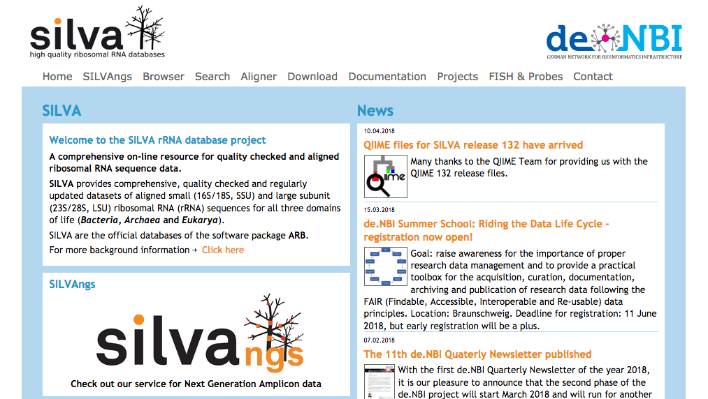
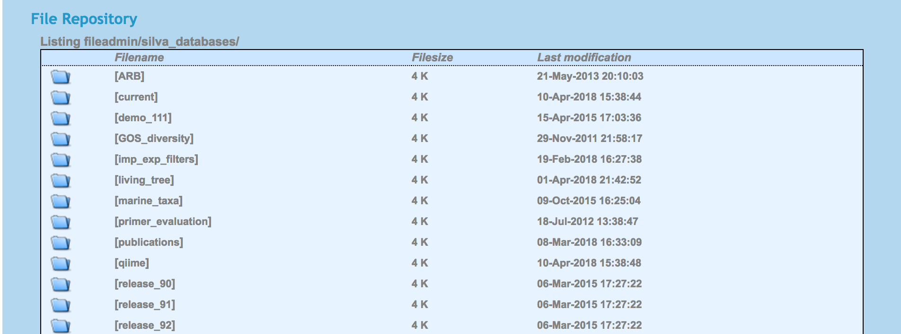

# Building rRNA classification databases

In order to understand the taxonomic composition of metagenomic samples it is need to classify sequences against a reference database. However, obtaining and using a database for taxonomic classification isn't trivial and the difficulties can be due to a range of issues you could encounter.
These issues could be due to the sequences you want to classify (is it shotgun data, or is it a marker gene like 16S rRNA, rpoB or another gene), the sequence repository you are using, the taxonomic content of the database, or your classification tool wants to have sequence data in a special format. That means that it is important to obtain a database that is suitable for your data, that has good taxonomic coverage of the taxa you are interested in, and that it is well curated (e.g. contains few misclassifications).

For instance the large NCBI NT or NR database contain sequences from most studied taxa, and when used for shotgun sequence it is able to classify the largest amount of sequences compared to most other databases. However, the taxonomic classification of many sequences using these two database can be problematic due to contamination, misclassifications or simply because people have been sloppy when adding their data to this repositories. Because of that, many initiatives were started to generate curated databases that had a specific audience in mind.

For instance ribosomal RNA sequences are highly abundant in the NCBI NT database, but their classification in that database is problematic and the quality of many sequences is poor. Several initiatives exist that have dealt with these issues and that resulted in different rRNA databases such as [Greengenes](http://greengenes.secondgenome.com/), [Ribosomal database Project](http://rdp.cme.msu.edu/), and the [SILVA database](https://www.arb-silva.de/). Each of these databases come with their own curation method applied to the rRNA data (imported from NCBI NT database), which results in slightly different databases.

My own preference for 16S rRNA database is to use the SILVA database (lucky for me it is considered to be the better database by several people in the field (what ever that means...)).

## Acknowledgements
In this tutorial we will follow the tutorial created by `Pat Schloss` on how to obtain the latest complete SILVA database (version 132) and make it suitable for use with the mothur pipeline. His tutorial is found here: [Building SILVA reference files](http://blog.mothur.org/2018/01/10/SILVA-v132-reference-files/).

## The SILVA database

Before we do anything, take your webbrowser and surf to the [SILVA database](https://www.arb-silva.de/) homepage. We first will explore this resources before starting with the good stuff. You will see something like the image below:


If you are interested in obtaining sequences you can use several options on the SILVA portal. Those are: `Browser`, `Search`, `Aligner` and `Download`. Note that the SILVA database contains sequence data for the small sub unit (SSU) and the large sub unit (LSU) of the ribosome found in prokaryotes and eukaryotes. Those are the 16S / 18S rRNA (SSU) or the 23S / 25S (LSU) rRNA molecules. The SSU database is the larger of the two and contains most sequences, but in principle both can be used. Remember that it is only due to history that most microbiome studies use the 16S rRNA, but that the marker is not the most optimal for classification.

```
Can you think of reasons why the 16S rRNA is not the most optimal gene to use for classification?
```
Okay let's check the menu options at the SILVA homepage. The `browser`and `search`options allow you to collect sequences belonging to taxa of interested. For instance you can collect all sequences belonging to the `Firmicutes`or only those from the `Ruminococcaceae`. When you use browse you can collect all those sequences.

In the browser window:

```
Add all Firmicutes sequences to the cart.
How many sequences are that?
```

When you use the search option you can filter based on sequence quality.
Search sequences with the following options:
* Taxonomy = FirmicutesSee
* Sequence length > 1300
* Sequence  quality > 95
* pintail quality > 90

```
How many sequences do you now obtain for Firmicutes?
```

The aligner is good when you have an rRNA sequence and want to know what is actually is, or if you want to obtain reference sequences to build a taxonomy.

Here is a set of [Thermosipho sequences](database_tutorial_files/Thermosipho_16S_rRNA.fasta) that you can use to classify and obtain reference sequences for further use. Download this file to your computer and then upload it to the [SINA aligment](https://www.arb-silva.de/aligner/) page. After selecting the file, click the box `search and classify`. This will allow you to select the number of neighbors per query sequences (max = 100). You can also change the minimum similarity of those hits with your query sequences. Then run the aligner tool. After it has finished you can see the classifications and you can add neighbor sequences to your shopping cart.

This was a short introduction to the SILVA database homepage. You do not often need it, but for some questions, it is good to know that it exists and that it can be a good resource in case you need to build phylogenies based on an rRNA molecule.

# Building a local 16S rRNA database
Now we will start with building the database locally so we can use it for our own amplicon analysis.
The first thing we need to do is login into our biolinux machine as the `system manager`. The reason for that is that we need to create a file which will export the silva_db from the arb format into a mothur compatible fasta file.

#### Adding the mothur export file to the biolinux arb installation.
In order to export the arb database sequence we want to export them with the mothur formatting.
Open a new terminal and type:

```
cd /usr/lib/arb/lib/export
```
In this directory we find the files with the export formats for arb. We will create the file:
`fasta_mothur.eft`.

```
sudo nano fasta_mothur.eft
```

Inside nano type:
```
SUFFIX          fasta    
BEGIN    
>*(acc).*(name)\t*(align_ident_slv)\t*(tax_slv);    
*(|export_sequence)    
```

#### Downloading the SILVA database
Now that we have created this file, we will change to our normal user account on the biolinx machine.

* Open a terminal .
* go to your Desktop directory and create a folder called: `silva_db`.
* change into the directory `silva_db`.

Now it is time to download the SILVA database. When you take a look at the `download` menu of the SILVA homepage, you will find three options: `TaskManager`, `ARB files` and `Archive`.

We when we just wanted to download a fasta file than we could be interested in the `Archive`, which contains many folders.


For instance, the  latest version of the Silva database, which is release 132, can be found under the [current link](https://www.arb-silva.de/no_cache/download/archive/current/Exports/) folder.
There you find a large number of files. The file `README`explains the difference between the files.

However, we want to make the sequences from the ARB database compatible with our own sequences. So we need to ARB files. The `ARB files` are needed for the ARB software, which is the software in which the SILVA database is maintained. We will be using that software on our biolinux since it is installed there.. For more details on ARB see here: [arb-home.de](http://www.arb-home.de/).

We are going to download an ARB file with the SILVA database. It will not be the complete database, but a non-redundant database, where 16s rRNA sequences are clustered with 99%  sequence similarity cut-off. That compressed file is still ≈ 300 Mb big. The commands we need to download it are:

```
wget -N https://www.arb-silva.de/fileadmin/arb_web_db/release_132/ARB_files/SILVA_132_SSURef_NR99_13_12_17_opt.arb.gz
gunzip SILVA_132_SSURef_NR99_13_12_17_opt.arb.gz
```
Now we can start up ARB with this ARB database with the command:

```
arb SILVA_132_SSURef_NR99_13_12_17_opt.arb
```

#### Exporting the database to a fasta file
This database contains almost 700.000 sequences and can not be used yet for mothur. We need to filter out low quality sequences and chimeras and then we need to export the data to a fasta file. When ARB is running do the following:

1. Click the search button
2. Set the first search field to ‘ARB_color’ and set it to 1.Click on the equal sign until it indicates not equal (this removes low quality reads and chimeras)
3. Click ‘Search’. This yielded 629,211 hits
4. Click the “Mark Listed Unmark Rest” button
5. Close the “Search and Query” box
6. Now click on File->export->export to external format
7. In this box the Export option should be set to marked, Filter to none, and Compression should be set to no.
8. In the field for Choose an output file name make sure the path has you in the correct working directory and enter: `silva.full_v132.fasta`.
9. Select a format: `fasta_mothur.eft`. This is a custom formatting file that Pat Schloss has created that includes the sequences accession number and it’s taxonomy across the top line. We create this file above, remember?
10. Save this as silva.full_v132.fasta (This will take about 5-10 minutes and creates a huge (≈ 30 Gb) fastafile). This file should contain `629,211`.

    `How can you determine how many sequences are present in that fasta file?`

11. You can now quit ARB. (When your biolinux machine is reacting slowly, restart the virtual machine down after closing ARB). That will clear the memory.

#### Screening the sequences

Now we need to screen the sequences for those that span the 27f and 1492r primer region, have 5 or fewer ambiguous base calls, and that are unique. We’ll also extract the taxonomic information from the header line. Run the following commands from a bash terminal:


    mothur "#screen.seqs(fasta=silva.full_v132.fasta, start=1044, end=43116, maxambig=5, processors=8);
    pcr.seqs(start=1044, end=43116, keepdots=T);
    degap.seqs();
    unique.seqs();"

The mothur commands above do several things. First the `screen.seqs` command removes sequences that are not full length and have more than 5 ambiguous base calls. Note: this will remove a number of Archaea since the ARB RN reference database lets in shorter (>900 bp) archaeal 16S rRNA gene sequences. Second, pcr.seqs convert any base calls that occur before position 1044 and after 43116 to `.` to make them only span the region between the 27f and 1492r priming sites. Finally, it is possible that weird things happen in the alignments and so we unalign the sequences (degap.seqs) and identify the unique sequences (unique.seqs). How many sequences do we end up with? We can check that:

    #checking number of sequences in the output files
    mothur "#summary.seqs(fasta=silva.full_v132.good.pcr.ng.unique.fasta, processors=8);"

The last command gives us the following table:

                Start   End     NBases  Ambigs  Polymer NumSeqs
    Minimum:        1       919     919     0       4       1
    2.5%-tile:      1       1387    1387    0       5       5328
    25%-tile:       1       1435    1435    0       5       53280
    Median:         1       1454    1454    0       6       106560
    75%-tile:       1       1469    1469    0       6       159840
    97.5%-tile:     1       1741    1741    2       7       207792
    Maximum:        1       3660    3660    5       24      213119
    Mean:   1       1474.4  1474.4  0.147401        5.62296
    # of Seqs:      213119

So the filtering reduced the number of sequences to 213119.
Let's continue with the commands on the bash commandline. Next we convert the resulting fasta file into an accnos file so that we can go back into mothur and pull out the unique sequences from the aligned file (`get.seqs`).

    #identify the unique sequences without regard to their alignment
    grep ">" silva.full_v132.good.pcr.ng.unique.fasta | cut -f 1 | cut -c 2- > silva.full_v132.good.pcr.ng.unique.accnos

    #get the unique sequences without regard to their alignment
    mothur "#get.seqs(fasta=silva.full_v132.good.pcr.fasta, accnos=silva.full_v132.good.pcr.ng.unique.accnos)"

    #generate alignment file
    mv silva.full_v132.good.pcr.pick.fasta silva.nr_v132.align

    #generate taxonomy file
    grep '>' silva.nr_v132.align | cut -f1,3 | cut -f2 -d'>' > silva.nr_v132.full

 At this point we have a full database file called: `silva.nr_v132.align`, and we have a file with the taxonomy extracted from the fasta headers of the align file: `silva.nr_v132.full`. This still contain 213119 sequences. But we are not yet ready to use this in mothur.

#### Formatting the taxonomy files
Now we want to make sure the taxonomy file is properly formatted for use with mothur. First we want to grab the SILVA taxa mapping file by running the following in bash:

```
wget https://www.arb-silva.de/fileadmin/silva_databases/current/Exports/taxonomy/tax_slv_ssu_132.txt
```
Thanks to Eric Collins at the University of Alaska Fairbanks, we have some nice R code to map all of the taxa names to the six Linnean levels (kingdom, phylum, class, order, family, and genus). We’ll run the following code from within R:

```
    map.in <- read.table("tax_slv_ssu_132.txt",header=F,sep="\t",stringsAsFactors=F)
    map.in <- map.in[,c(1,3)]
    colnames(map.in) <- c("taxlabel","taxlevel")
    map.in <- rbind(map.in, c("Bacteria;RsaHf231;", "phylum")) #wasn't in tax_slv_ssu_132.txt

    #fix Escherichia nonsense
    map.in$taxlevel[which(map.in$taxlabel=="Bacteria;Proteobacteria;Gammaproteobacteria;Enterobacteriales;Enterobacteriaceae;Escherichia;")] <- "genus"

    taxlevels <- c("root","domain","major_clade","superkingdom","kingdom","subkingdom","infrakingdom","superphylum","phylum","subphylum","infraphylum","superclass","class","subclass","infraclass","superorder","order","suborder","superfamily","family","subfamily","genus")
    taxabb <- c("ro","do","mc","pk","ki","bk","ik","pp","ph","bp","ip","pc","cl","bc","ic","po","or","bo","pf","fa","bf","ge")
    tax.mat <- matrix(data="",nrow=nrow(map.in),ncol=length(taxlevels))
    tax.mat[,1] <- "root"
    colnames(tax.mat) <- taxlevels

    outlevels <- c("domain","phylum","class","order","family","genus")

    for(i in 1:nrow(map.in)) {
            taxname <- unlist(strsplit(as.character(map.in[i,1]), split=';'))
            #print(taxname);

            while ( length(taxname) > 0) {
                  #regex to look for exact match

                  tax.exp <- paste(paste(taxname,collapse=";"),";",sep="")
                  tax.match <- match(tax.exp,map.in$taxlabel)
                  tax.mat[i,map.in[tax.match,2]] <- tail(taxname,1)
                  taxname <- head(taxname,-1)
          }
    }

    for(i in 1:nrow(tax.mat)) {
            #this fills in the empty gaps by using the closest higher taxonomic level appended with an abbreviation for the current taxonomic level
            #if you don't want this behavior, cut it out
            for(j in 1:ncol(tax.mat)) {
                    if(tax.mat[i,j] < 0) { tax.mat[i,j] <- paste(tmptax,taxabb[j],sep="_")}
                      else { tmptax <- tax.mat[i,j]}
            }

            #this maps the new name to the input taxonomic levels
            map.in[i,"taxout"] <- paste(paste(tax.mat[i,outlevels],collapse=";"),";",sep="")
    }

    # replace spaces with underscores
    map.in$taxout <- gsub(" ","_",map.in$taxout)

    # bring in the old taxonomic levels from SILVA and remap them using the new levels
    tax.in <- read.table("silva.nr_v132.full",header=F,stringsAsFactors=F,sep="\t")
    colnames(tax.in) <- c("taxid","taxlabel")

    # Following line corrects the Bacteria;Bacteroidetes;Bacteroidia;Flavobacteriales;Flavobacteriaceae;Polaribacter;Polaribacter; problem
    tax.in$taxlabel <- gsub("Polaribacter;Polaribacter;", "Polaribacter;", tax.in$taxlabel)
    tax.in$taxlabel <- gsub(";[[:space:]]+$", ";", tax.in$taxlabel)

    tax.in$id <- 1:nrow(tax.in)

    tax.write <- merge(tax.in,map.in,all.x=T,sort=F)
    tax.write <- tax.write[order(tax.write$id),]


    #we want to see whether everything has 6 taxonomic level (kingdom to genus)
    getDepth <- function(taxonString){
            initial <- nchar(taxonString)
            removed <- nchar(gsub(";", "", taxonString))
            return(initial-removed)
    }

    depth <- getDepth(tax.write$taxout)
    summary(depth) #should all be 6 and there should be no NAs
    bacteria <- grepl("Bacteria;", tax.write$taxout)
    archaea <- grepl("Archaea;", tax.write$taxout)
    eukarya <- grepl("Eukaryota;", tax.write$taxout)

    tax.write[depth > 6 & bacteria,] #good to go
    tax.write[depth > 6 & archaea,]  #good to go
    tax.write[depth > 6 & eukarya,]  #good to go

    write.table(tax.write[,c("taxid","taxout")],file="silva.full_v132.tax",sep="\t",row.names=F,quote=F,col.names=F)
```

#### Building the SEED references
The first thing to note is that SILVA does not release their SEED; it is private. By screening through the ARB databases we can attempt to recreate it. Our previous publications show that classify.seqs with the recreated SEED does an excellent job of realigning sequences to look like they would if you used SINA and the true SEED. Now we want to try to figure out which sequences are part of the seed. Earlier, when we exported the sequences from ARB, we included the align_ident_slv field from the database in our output. Let’s generate an accnos file that contains the names of the sequences with 100% to the SEED database and then use mothur to generate SEED fasta and taxonomy files. While we’re at it we’ll also generate the nr_132 taxonomy file as well. The following code will be run from within a bash terminal:

    grep ">" silva.nr_v132.align | cut -f 1,2 |grep $'\t''100'|cut -f 1 |cut -c 2- > silva.seed_v132.accnos

The accnos file should now contain a list of 11180 sequence IDs. Do you remember how you could count the items in such a list on the commandline?

    mothur "#get.seqs(fasta=silva.nr_v132.align, taxonomy=silva.full_v132.tax, accnos=silva.seed_v132.accnos)"
    mv silva.nr_v132.pick.align silva.seed_v132.align
    mv silva.full_v132.pick.tax silva.seed_v132.tax

    mothur "#get.seqs(taxonomy=silva.full_v132.tax, accnos=silva.full_v132.good.pcr.ng.unique.accnos)"
    mv silva.full_v132.pick.tax silva.nr_v132.tax

So now we are done with building the SILVA database

#### Taxonomic representation
When you are interested in knowing the difference between the full SILVA database and the seed SILVA database than I advice you to run the code that you can find on the tutorial page from Pat Schloss: [Building SILVA reference files](http://blog.mothur.org/2018/01/10/SILVA-v132-reference-files/)


#### archiving the silva_databases
The final step in this tutorial is to archive it so you can store it somewhere safely

the commands:

```
tar cvzf silva.nr_v132.tgz silva.nr_v132.tax silva.nr_v132.align
tar cvzf silva.seed_v132.tgz silva.seed_v132.tax silva.seed_v132.align
```

store it safely, for example.
```
rsync -rv silva.*.tgz ~/data/silva_db/
```

The database file created for this tutorial can also be found in the nn9305K directory. Specifically in the directory:

```
/work/projects/nn9305k/db_flatfiles/silva_databases
```

When you want to use those, copy them to your own directory and uncompress the files with:

```
tar -xvzf silva.nr_v132.tgz
```

Now you should be set to classify your own SSU rRNA sequences.
