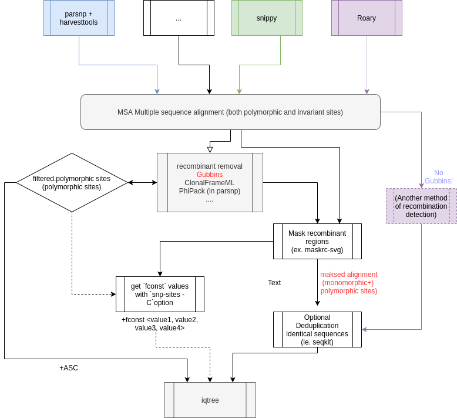

# Making not too wrong phylogenetic trees with IQ-TREE


# Dictionary

- **invariant sites**: sites (bases at specific loci/positions) that are identical for all the analysed isolates/sequences.
- **polymorphic sites**: sites that with variation: several forms (different bases)
- **Informative sites**: are polymorphic sites that support one grouping of taxa over another grouping.  You can read a bit about this concept derived from parsimony analysis [here](https://www.mun.ca/biology/scarr/2900_Parsimony_Analysis.htm), in IQ-TREE documentation (search for "LIKELIHOOD MAPPING STATISTIC" in the [Command reference document here](http://www.iqtree.org/doc/Command-Reference))

# Introduction

IQ-TREE is a software that use maximum likelihood algorithm to infer phylogenies. You can read the article [here](https://academic.oup.com/mbe/article/32/1/268/2925592), the software and documentation are hosted [here](http://www.iqtree.org/).

- input for IQ-TREE require a sequence multiple alignment (including invariant sites and polymorphic sites) **OR** of variants/SNPs (polymorphic sites). You choose the tools you want to do that. Bellow is an overview of the different softwares and steps you might want to consider.
- output: a tree - or a **consensus tree** if you used bootstrap to estimate branch support (even if we often display support on nodes - this is actually branch support). You should always have an idea of how branches are supported, because you cannot interpret your phylogeny if you do not know how reliable it is. Bootstrap support will allow you to determine which groups of taxa you can consider as likely true and which ones are undetermined.

### A note on multi sequence alignment (MSA):

There are many softwares to do that. And each of them as their advantages and disadvantages.

A rule of thumb for choosing: it depends how closely related your samples to be aligned are. You can have a fast estimate using [FastANI](https://github.com/ParBLiSS/FastANI) (installed in saga)

- very closely related (≥97% nucleotide identity): ie. [parsnp](https://genomebiology.biomedcentral.com/articles/10.1186/s13059-014-0524-x) , [snippy](https://github.com/tseemann/snippy) (using a close reference)
- distantly related (some isolates < 95%)  you might want to consider obtaining an alignment of shared genes. E.g extracted from [Roary](https://sanger-pathogens.github.io/Roary/) pangenome analysis. You might also want to consider [Mauve/progressive Mauve](https://genome.cshlp.org/content/14/7/1394) (a nice reading to understand some problems with MSA of whole genome data).
- If you cannot use a reference, you can e.g. extract concatenated polymorphic sites with [ksnp3](https://academic.oup.com/bioinformatics/article/31/17/2877/183216)

This is however NOT an EXHAUSTIVE list of possibilities.

In all cases: you need to understand the hypothesis and main idea on how the alignment is done, because this will influence which steps you perform, including eg. if you do not do not remove possible recombination (ie. with [Gubbins](https://academic.oup.com/nar/article/43/3/e15/2410982)). **Never use Gubbins to remove recombinant sequences on concatenated genes alignment!.**

# Possible workflow overview

<center>
  
</center>


# How to create a tree with iqtree?

- You start with a multiple sequence alignment (MSA) with the method of your choice
- If this is actual you detect and filter out recombinant regions (NB: do not do this if your multiple alignment is a concatenated alignment of gene sequences) (what does actual mean?)
- Then you have basically 3 options that will decide how you run IQ-TREE:
    1. you want to run iqtree with the MSA with only polymorphic sites (SNPs): then you will have to:
        - perform a correction of branch length - with `+ASC` option. **This is the least recommended method because it uses an algorithm to estimate a correction to be applied on branch lengths** (black part).
        - **Why is this the least recommended method ?** **because some model use frequencies of ATCG to estimates probabilities of nucleotide substitutions.** [Those probabilities of nucleotide substitutions can depend on the amount of ATCG you have originally in your genome, and models assume that changes are leading to a "neutral sequence" where each base is represented at 25%" - this is called the "equilibrium frequencies". Some models estimate the probabilities of substitution for each base, depending on what is in your sequences (empirical), and the sequence composition at equilibrium. Consequently, those evolutionary models that depend on estimating the empirical frequencies in your dataset cannot do that on variable sites only, because it might introduce a strong bias in base composition - indeed you might have base composition difference between your monomorphic sites and variable sites...]

    2. you provide the IQ-TREE `fconst`  option and values. `fconst` are the count of each nucleotide at the invariant sites (which is used to compute empirical base frequencies, as discussed above).

    - As mentioned in [IQ-TREE command reference manual](http://www.iqtree.org/doc/Command-Reference):

    > `-fconst 10,20,15,40` will add 10 constant sites of all A, 20 constant sites of all C, 15 constant sites of all G and 40 constant sites of all T into the alignment.

    - This method then require an additional step: that you find the count for each base. This can be done with [snp-sites](https://github.com/sanger-pathogens/snp-sites): `snp-sites -C` option (snp-sites will output either at the screen or in a text file those values). This method can help iqtree running faster (because then it does not need to go through the sequences and find variants and as well estimate invariant frequencies for each site - so you can use it when you have a lot of sequences with many different snps - but the gain might be marginal.
    - NB: you can read: [Blog post on fconst, ASC: how to run iqtree appropriately](https://bitsandbugs.org/2019/11/06/two-easy-ways-to-run-iq-tree-with-the-correct-number-of-constant-sites/))


    3. you provide the multiple alignment with recombinant masked (using `N`)  and let IQ-TREE find the frequency of invariant base and polymorphic sites - this is the easiest option (I think)

### Example of IQtree commands

- According to what you choose you run iqtree a bit differently
- Example with the common options
    - -s [MSA.fast](http://msa.fast)a (your input file)
    - -m : model choice (TESTNEW → model test)
    - -bb: number of **fast bootstrap** to run
    - -nt (Specify the number of CPU cores for the multicore version: match your slurm script)
    - -mem (Specify maximal RAM usage - match your slurm script)
    - -o <outgroup - sequence name> optional: if you want to specify an outgroup.

```bash
# Activate conda
conda activate IQTree
```

- you run with MSA (with masked recombinants *- choice 3. described above*) - as in my pipeline (see bellow)

```bash
iqtree -s  MSA.fasta -m TESTNEW -bb <number bootstraps> \
      -nt <number_cpus> -mem <maximum_memory> -o <sequence name>
```

- you run on filtered polymorphic sites only (+ASC) is added to the model parameter (*choice 1. described above*)

```bash
iqtree -s  filtered<.fasta OR .phy> -m TESTNEW**+ASC** -bb <number bootstraps> \
      -nt <number_cpus> -mem <maximum_memory> -o <sequence name>
```

- your run on filtered polymorphic sites AND provide the bases count for invariant sites (*choice 2. described above*)

-`fconst` add number of constant sites for A, C, G T

```bash
iqtree -s  filtered<.fasta OR .phy> -m TESTNEW -fconst 10,20,15,40 \
-bb <number bootstraps> -nt <number_cpus> -mem <maximum_memory> \
-o <sequence name>
```

```bash
# deactivate conda
conda deactivate
```

## Example of commands for all the steps

Step1: Getting your Multiple alignment (choose one option)

- option: **multiple alignment with parsnp** and format conversion with harvesttools

Common options:

`-c` ignore MUMs forces all genomes to be in run (ie if samples very closely related you can try without -c  - **BUT** please check that all your sequences are included in the multiple alignment afterwards
`-x` enables recombinant filtering SNPs with PhiPax (practical if want to inspect manually) - but **not necessary if you have another way to remove recombinant afterwards**
`-e` greedily extend LCBs (experimental option)
`-u` output unaligned regions (if you want to check those afterwards)
`-v` verbose output (allows to capture log)

```bash
conda activate ParSNP
# running with a genebank (gbk) reference
parsnp -g <reference_file> -d <folder_all_other_sequences.fasta> \
-o <outputfile> -c -e -u

# running parsnp with fasta reference
parsnp -r <reference_file> -d <folder_all_other_sequences.fasta> \
-o <outputfile> -c -e -u

# running parsnp with randomly choosen reference
parsnp -r ! -d <folder_all_other_sequences.fasta> -o <outputfile> -c -e -u

conda deactivate

###########################################################################
# converting the ggr (parsnp output) to multifasta

conda activate Harvesttools

## minimal output
harvesttools -i <parsnp.ggr> -M <MSA_output.fasta>

## you want the rest of output: example
harvesttools -i <parsnp.ggr> -M <MSA_output.fasta>  \
-S multi-fasta_SNPs -V SNPs -N tree

conda deactivate
```

---

- option: **multiple alignment with snippy**

You need a tab separated file to run snippy multi (see [documentation](https://github.com/tseemann/snippy)) and  "[Variant calling with SNIPPY](https://github.com/NorwegianVeterinaryInstitute/BioinfTraining/blob/master/variant_calling_snippy.md)"

For those familiar with R, there is a little script to do that in R (which can be improved, so you are welcome to suggest improvement) that can be found [here](https://github.com/NorwegianVeterinaryInstitute/yersinia/blob/master/src/R/prep_tab_for_snippy.R)

Also, another script for creating this tab-separated file can be found here:
https://github.com/hkaspersen/bash_scripts/blob/master/scripts/snippyfy.bash
Note that this script needs to be changed to fit your data, as in its current form it needs the read files to end with 1.fastq.gz and 2.fastq.gz. 


```bash
conda activate Snippy

# create multiple snippy input file & output unmapped reads
snippy-multi <my_tab_separated_file.txt> --ref <reference.gbk> \
--cpus <number_CPUs> --unmapped > snippy_run_script.sh

# check the script makes sense
cat snippy_run_script.sh

# running the script (this also runs snippy core)
sh  snippy_run_script.sh

```

---

Recombinant detection and masking recombinant sequences

- option: recombinant detection/removal with gubbins

```bash
conda activate Gubbins

# choosing hybrid to start the tree building
run_gubbins.py --tree_builder hybrid --raxml_model GTRGAMMA \
  --verbose --prefix gubbins_out <MSA.input.fasta>

conda deactivate
```

---

- masking recombinants

`--aln` is your input file

`--out` is your output file

```bash
conda activate maskrc-svg

maskrc-svg.py --aln <MSA.input.fasta> --gubbins <folder/gubbins_prefix> \
  --symbol "N" --out <path/masked_recombinant_MSA.fasta> \
  --region recombinant_regions --svg recombinant_plot --svgcolour "#1D00F8"

conda deactivate
```

gubbins_prefix is everything before the  `.`in the output files given by gubbins

This will also make a nice little plot (where you can see where on the genome the recombinant sequences have been detected)

---

Optional deduplicating of identical sequences (this will also output a list of identical sequences)

Depending on how similar your sequences are, it is possible that they actually become identical because the difference between those if found at sites that did not align.

Note: This is Not really needed for IQ-TREE because it will detect those and handle them, but it might be usefull to get a list, if you want to further analyse those "duplicates" belonging to the same group afterwards (analysing those separately ie realigning those with parsnp might increase the size of the shared core alignment, and therefore you might be able to find variable sites that you missed with the whole dataset alignment). Note also that some other phylogenetic softwares might not handle having duplicated sequences in input files.

The first file is your input file

`--o` is your output file (deduplicated MSA)

```bash
conda activate seqkit

seqkit rmdup <masked_recombinant_MSA.fasta> -s \
  -D seqkit_list_duplicated \
  -d seqkit_duplicated_seq \
  --alphabet-guess-seq-length 0 \
  --id-ncbi -t dna \
  -w 0 -o <deduplicated_masked_recombinant.fasta>

conda deactivate
```

---

Optional: pairwise snp distances with snp-dists

This is common to report snp-distances. But remember there is a difference between evolutionary distance and snp-distances

Your input file must be the same as the one you used to create the tree with iqtree

```bash
conda activate snp-dists

snp-dists -m -c <MSA_masked_recombinant.fa> > output_snp-dist.csv

conda deactivate
```

## Interpreting fast bootstrap values

Branches that are **considered as supported** when using `fast bootstrap` method of iqtree is:

<a href="https://www.codecogs.com/eqnedit.php?latex=bootstrap&space;\geq&space;95" target="_blank"></a>

 You can read [here](https://github.com/Cibiv/IQ-TREE/wiki/Frequently-Asked-Questions#how-do-i-interpret-ultrafast-bootstrap-ufboot-support-values) about interpretation.

## Maximum Likelihood Trees are naturally unrooted

**All maximum likelihood trees are naturally unrooted UNLESS you specify an outgroup.**

This means that there is NO directionality of evolution, therefore you cannot interpret which group diverged earlier than other. To do so you need to root your tree, this will give directionality to your trees. You can read this nice blog [here](http://cabbagesofdoom.blogspot.com/2012/06/how-to-root-phylogenetic-tree.html) for the different methods to root a tree a-posteriori.

## Visualising your trees (and bootstrap values problematic)

There are many different tools to visualize your trees.

But you need to be aware that some softwares (and it is commonly done) allow labelling bootstrap support values on nodes, however many do not handle rerooting well - and after rerooting labels might be displayed at the wrong place. You can read [here](https://academic.oup.com/mbe/article/34/6/1535/3077051) about this problem. If you need to reroot your tree use one of the "trusted" software to compare display of bootstrap values.

---

# An example of ready made pipeline: my bash pipeline (in Red)

- It is a pipeline I made for myself. But feel free to use it. You can also modify it to adjust it to your needs.

    NB: If you want to run my pipeline as is, you will need to adjust the paths according to where you put the code, and paths according to your analysis.

    - The source code of the pipeline is found [here](https://github.com/NorwegianVeterinaryInstitute/yersinia/blob/master/src/bash/core_parsnp_gubbins_masking_iqtree.sh) (you need access to VI github).
    - There is a configuration file where I source the code, you can find this [configuration file example here](https://github.com/NorwegianVeterinaryInstitute/yersinia/blob/master/src/config_examples/core_parsnp_gubbins_iqtree_config.sh). (You can actually copy the content of the configuration file in a slurm script**).**

    Example for slurm (adapted from Thomas example):

    My sequences are very similar - you might want to increase memory and time

    ```bash
    #!/bin/bash
    #SBATCH --account=nn9305k
    #SBATCH --time=1:30:00 # should work with ca 150 very similar sequences (was exact time)

    ##memory specs
    #SBATCH --mem-per-cpu=24G     ## This is the maximum memory for a job with a single cpu on normal node
    #SBATCH --cpus-per-task=1    ## total number of cpus
    #SBATCH --job-name=20200316_ML_core_tree
    #SBATCH --mail-user=myemail@vetinst.no ## change this
    #SBATCH --mail-type=ALL

    ## creating output file for debugging and error analysis.
    #SBATCH --output=/cluster/projects/nn9305k/active/<username>/<logname>.%j.out ## adjust where you want slurm log

    ##--------------------------------------------------------------------------------

    ## paste here the content of the configuration file
    ## adjust the path - including path for the source code

    ## -----------------------------------------------------------------------------
    ## end of your slurm file (ie see Thomas examples)
    ##--------------------------------------------------------------------------------
    ```

    What does the pipeline do?

    - It creates a multiple alignment with `parsnp` (part of `Harvest suite`) and convert to a format suitable for gubbins input with `harvesttools`(also part of `Harvest suite`). This is only suitable for very closely related isolates. You can read the article for harvest suite [here](https://link.springer.com/article/10.1186/s13059-014-0524-x), and the documentation [here](https://harvest.readthedocs.io/en/latest/).
    - Then performs an inference of recombination detection with `gubbins`. You can find the link for the paper and the documentation [here](https://sanger-pathogens.github.io/gubbins/). (there are several documentation versions, you can google)
    - Then it masks recombinant (replacing those regions with a symbol of our choice BUT we need to use `N` for iqtree) with a python script [`maskrc-svg.py`](http://maskrc-svg.py/). You can find [here](https://github.com/kwongj/maskrc-svg) the instructions to run it (in case you want to do something different).
    - There is an **optional step** of sequence deduplication (removal of identical sequences with `seqkit`). Ideally this should be done right before using any phylogenetic tools - BUT as both `iqtree` and `RAxML` (used as part of Gubbins) detect and deal with those identical sequences I only use it to have information on which sequence are identical (ie - if I want realign those sequences).
        - NB: Why can we have identical sequences? - when we use parsnp only the LCB (collinear blocks) found in most sequences can be aligned. So if you have a little subgroup with a sequence fragment that is different from the rest this means that this will be removed from the multiple alignment. So, if you have very closely related isolates, this is possible that the only differences between those samples are within this little fragment, that is removed from the MSA in parsnp. Consequently some sequences might be identical
        - This step is optional also because in case there are duplicate sequences in your dataset, they will be ignored by iqtree, but will be added at the end in the tree (as unresolved leaves - at the same level of the one they are identical to). You can see that in the iqtree log.
        - you can find links for `seqkit` documentation [here](https://github.com/shenwei356/seqkit)
    - This runs iqtree either on the deduplicated MSA or on the MSA where recombinant have been masked. You can decide to include or not an outgroup, choose how many fast bootstrap replicates to do, select a model or run a model test (as in my config example file)
    - This pipeline runs an **additional step: calculating the snp-distance between pairs of sequences** with `snp-dists` the documentation of snp-dists can be found [here](https://github.com/tseemann/snp-dists). This calculation is done on the MSA filtered for recombinants - in case you want to add snp differences on your tree
    - To run this pipeline on saga use the wrapper: `run_saga_tree` - note you can also run each module separately, but then you have to activate the proper conda environments.
    - Your final tree with support values is the consensus tree: `*.contree`
