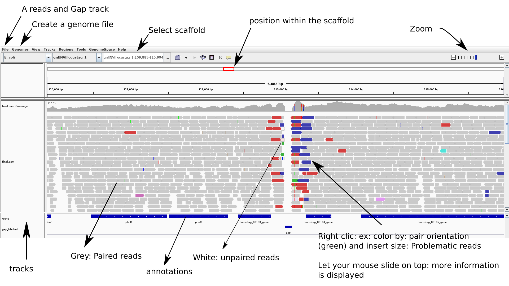

# Visualize your assembly with [IGV](http://software.broadinstitute.org/software/igv/home)

 **IGV**: Integrative Genomics Viewer.

 We will use this software to evaluate our assemblies, among others to view how the reads map to the assembly.

 We will also add tracks with genome annotation and gaps.

## 1. Mapping the reads against a reference/assembly

### 1.1 What is read-mapping

It is simply finding a/the matching locus/area of a read on a sequence. You could think of it at the location of where your read would hybridize to your genome if you could do this experiment

Usually few mismatches are allowed (think about the consequences).

Reads can be mapped as paired or single. If paired is used, then the matching regions are defined by the insert size and the length of each read

<p align="center">
<a href="https://commons.wikimedia.org/wiki/File:Mapping_Reads.png"> 
<br>
</p>

### 1.2 Why mapping reads

Read mapping techniques are used for several purposes. Some examples:

1) To evaluate the quality of an assembly (or to compare different methods used to assemble your reads). Read mapping can help identifying problematic areas. Indeed, statistics are necessary but might not be sufficient to evaluate the quality of your assembly.

We want to look at:
- the coverage regularity (ex: some repeated regions might have increased coverage)
- the coverage at the beginning and end of scaffolds - is it good enough?
- are they positions where pileup of reads show polymorphism?
- ...

2) To identify SNPs: some methods use reads mapping against a reference genome to identify and type SNPs

3) Assembly polishing software such as `pilon` and `reapr` use mapped reads to identify potential improvement in assemblies. It is good to visualize what information they are using.

Softwares can use variation in coverage, wrong read pairs orientation, discrepancy between expected insert size and actual insert size obtained from read mapping (ie. longer than expected) to improve assembly.


### 1.3 Re-map the reads to the assembly

We use [bwa mem] option from [bwa tools] software.

We have assembled reads and annotated using Bifrost pipeline. The data for today's practical are found in `/projects/nn9304k/bioinf_course/Mapping_training`

You will use the trimmed-filtered reads in: `/projects/nn9305k/bioinf_course/Mapping_training/bifrost_run/bbduk_trimmed` and the assembly: `/projects/nn9305k/bioinf_course/Mapping_training/bifrost_run/prokka/MiSeq_Ecoli_MG1655_50x.fna`

We have to use the assembly output from `Prokka`to be able to visualize the assembly with IGV. (Labels between assembly and annotations have to be consistent for the visualisation).

Note that: `Prokka` transforms labels from the assembly used as input. Annotation and assembly with annotation-matching labels are provided as output files.

--------------------------------------------------------------------------------
--------------------------------------------------------------------------------
_**Practical:**_


In your `project-home` directory make a directory for today's work
and a folder called `mapping` where you will **copy** the input files

```bash
mkdir mapping
cd mapping

cp /projects/nn9305k/bioinf_course/Mapping_training/bifrost_run/bbduk_trimmed/*.fq.gz .
cp /projects/nn9305k/bioinf_course/Mapping_training/bifrost_run/prokka/MiSeq_Ecoli_MG1655_50x.fna .
# Also copy the annotation file .gff that we will need it later on
cp /projects/nn9305k/bioinf_course/Mapping_training/bifrost_run/prokka/MiSeq_Ecoli_MG1655_50x.gff .

# look at the file content (one reads-file, the assembly file):
head MiSeq_Ecoli_MG1655_50x.fna
gunzip -cd MiSeq_Ecoli_MG1655_50x_S_concat_stripped_trimmed.fq.gz | head

```

We will use the software included in the Bifrost pipeline.
This is available as a **conda environment**, called **bifrost**.

```bash
qlogin --account=nn9305k --time=00:30:00 --ntasks=4 --mem-per-cpu=4G
source activate bifrost

# 1) We need to index the reference: we are in this case using the assembly as reference
bwa index <reference.fna>

# 2) We map the reads (attribute the position of the reads according to the index) as PE
bwa mem -t 4 <reference.fna> <in1:read1.fq.gz> <in2:read2.fq.gz> \
| samtools sort -o <out:PE_mapped_sorted.bam> -

# NB: We `sort` directly the mapping by index position
#`-` means that the output of the pipe is used as input in samtools

#For unpaired reads (called S here)
bwa mem -t 4 <reference.fna> <in:S_reads.fq.gz> \
| samtools sort -o <out:S_mapped_sorted.bam> -

# We need to merge those two files as one
samtools merge <out:all_merged.bam> <in1:S_mapped_sorted.bam> <in2:PE_mapped_sorted.bam>

# To be sure reads are still sorted: we resort
samtools sort -o <out:final_all_merged.bam> <in:all_merged.bam>
```
<br>

**OPTIONAL**

Some software like `Pilon` need and updated index of mapped reads to run
(eg. after merging bam files). If necessary do:
`samtools index <final_all_merged.bam>`

### 1.4 The [sam/bam file format](https://samtools.github.io/hts-specs/SAMv1.pdf)

You can also have a look at [Samtools article] and at [Samtools manual]

`.bam` files (position indexed mapped-reads) are in a compressed binary format. We need to transform the `.bam` (to a `.sam` file) to be able to see how indexed mapped-reads are represented in the file.

To decompress: chose f.eks. `PE_mapped_sorted.bam` that we did in the first step:

`samtools view -h -o <out.sam> <in.bam>`

Look at your `.sam` file with:

 `less <filename.sam>`

### 1.5 looking at how the reads maps against the reference with [Samtools](http://www.htslib.org/doc/samtools.html) `tview` module

```bash
# look at the reads pileup
samtools tview  <final_all_merged.bam> --reference <assembly>
# -p <position> if you want to see a specific position
```
type `?` to view the navigation help while samtools is running


# 2.Viewing assembly and mapping with IGV

## 2.1 Install IGV in conda
At your pc:

```bash
conda create -n <envname> -c bioconda igv
conda activate <IGV:envname>

# we will need biopython for next part - insall it also
conda install -c anaconda biopython
```

From the folder you want to work in transfer the following files from Abel:
- the assembly and annotation files
- the .bam file
- the script that we will use to create gap.files (see below) - visual help on For IGV

```bash
scp <user_name>:/work/projects/nn9305k/vi_src/diverse/scaffoldgap2bed_py3.py .
scp <user_name>:<your_mapping_folder_assembly_AND_annotation_files> .
```

## 2.2 creating gap tracks

We use a little python script from [sequencetools repository](https://github.com/lexnederbragt/sequencetools) to insert gap locations into a file and load it as a track in IGV. This will allow to easily locate the different scaffolds and potentially problematic regions. This is how we generate the file:

```bash
# use conda to generate the .bed file
conda activate <IGV:envname>
python ./scaffoldgap2bed_py3.py -i <assembly.fasta> > <name_gaps>.bed
```

## 2.3 Fetch annotation files `.gff`

In `Bifrost` we annotated the assembly with `Prokka` (using annotations derived from a reference genome) `.gff` file. It contains the annotated gene locus `tags` that we use for visualization with IGV

## 2.4 Loading files in [IGV](https://software.broadinstitute.org/software/igv/)

<p align="center">

<br>
</p>

1. Create a `genome file` this allows associating tracks to the assembly : `Genomes > create.genome file`. Use the menu to select your assembly file `.fasta`and the annotation-gene file: `.gff`

2. Load your `mapped reads` and the `gap file` using: `file > load from file`

3. To be able to easily re-open (without re-importing everything you can do): `file > save session`

Now you are ready to navigate and explore your assembly.

**Try to find a gap.**

**NB**: To zoom while staying centered on the gap: click above menu (position within the scaffold - at the gap - top track) then click with the mouse at the gap position on the gap track (until appropriate zoom is obtained).

You can look here for [Options and interpretation](http://software.broadinstitute.org/software/igv/PopupMenus#AlignmentTrack),
and here: [PE orientations](http://software.broadinstitute.org/software/igv/interpreting_pair_orientations).

Have a look at:
- coverage
- gaps positions
- some strange scaffolds?
- PE orientations: in detail how the reads map to your assembly (you will need to zoom a lot)
- are some PE reads miss-oriented? reported as having abnormal insert sizes?

_________________________________________________________________

# Going further

You can look here at the [Uio course] for more details or if you want to do things slightly differently. We reuse some of their [scripts](https://inf-biox121.readthedocs.io/en/2017/Assembly/practicals/Sources.html).

[Uio course]:https://inf-biox121.readthedocs.io/en/2017/Assembly/practicals/03_Mapping_reads_to_an_assembly.html
[bwa mem]:http://bio-bwa.sourceforge.net/bwa.shtml
[bwa tools]:http://bio-bwa.sourceforge.net/
[Samtools article]:https://academic.oup.com/bioinformatics/article/25/16/2078/204688
[Samtools manual]:http://www.htslib.org/doc/samtools.html
