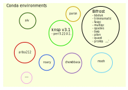

# Using software installed in conda

## What is conda?

Conda is a package (=software) and environment management system. An environment
is a container of package(s).

Think of an environment as a bubble. When you are in your bubble you do not to
be disturbed by anything outside your bubble. Conda allows the creation of several environments, that do not interact with each other. Please read the explanations in [techstuff](techstuff.md#conda-virtual-environments). 
If you  are a first time user of conda in Abel - please look here to set up appropriate configuration for project nn9305k [techstuff](techstuff.md#How to set up conda for project nn9305K) 



**In other words**:
Creating an environment name=X1 to run a particular software is extremely useful when
the software you want to work with depends (=a dependency) on one or several other
softwares=Y of a specific version to function.

If you want to use a software that depends on other versions of software=Y you can install those
in different environments (eg. name=X2). Then softwares installed in each  won't interfere
with each other.

There are several several packages installed within several conda enviroments for you to work with on Abel. See below.

> PS: be sure that you did follow at first time login the instructions: "[On first time login](https://github.com/NorwegianVeterinaryInstitute/organizational/wiki/Abel-User-Guide)" as it automatically configure some parameters that are needed for you to be able to use conda environments on Abel. **If you did it - you do not need to do it again.**

## Working with softwares installed in conda environments

- activating conda: `conda activate`
- viewing the environment list: `conda env list`
- listing packages installed in a specific environment: `conda list -n <environment_name>`
  > allows you to see which version of software are installed in each environment)
- activating an environment: `source activate <environment_name>` : enables working with softwares within the activated environment
  > if you want to look at the packages _while the environment is activated_ you need to use: `conda list` the list can be long: if you want look only at a part of the list: `conda list <you_want_to_look_at>` ex. `conda list trim*` give me the packages installed that begins with 'trim'
- deactivating an environment (or deactivating conda) `conda deactivate`
  > if an environment is activated: you need to **deactivate twice**: first to deactivate the environment and then to deactivate conda
- getting help: `conda --help`

1. request for resources (if slurm.script > steps below in the script)
2. activate conda and environment
3. your commands (program you want to use with parameters)
4. deactivate conda and environment

> Oops: bifrost pipeline: ask for resources when you submit the running.scripts.

## Installing packages on conda: **contact Karin**

> if packages you want to work with are neither available on Abel nor conda, and you feel unsure how to install:
> you need to contact Karin

**For Everybody** 

### Checking if conda channels are in the right order - and setting Conda channels in the right order

When you want to create a new environment on Abel (The first time you do that): you need to check that the channels are configured in the right order: `conda config --show-sources`
You should see: in the same order:
```
- conda-forge
- bioconda
- defaults
```

If they are not in this order you need to change that: you will add all those channels starting by the ones at the bottom `defaults`then `bioconda` and finally `conda-forge` using: 

`conda config --add channels new_channel`

Recheck that the channels are now displayed in the right order with conda `config --show-sources`

### Creating and installing within a new environment

There are several ways to do that: one that is quiet practical is: 

**First way** : full control 

1) create a new environment: `conda create --name myenv`. If the packages that you want to install require a specific python version you can specify this when creating the environment: `conda create -n myenv python=3.4`

2) Activate the newly created environment: `source activate myenv`

3) Paste the installation command you found when googling "conda install what you were interested in" ex: 
`conda install -c bioconda seqtk`. Note that you actually do not to define -c bioconda here, because conda will look up in the above define channels by order of priority. 

4) NB: you can eventually install several packages in the same conda environment - provided they do not require the same module/package but with different versions to work. 

It can be quiet convenient when you want to have an analysis pipeline.

5) when you are finished installing/using conda: `conda deactivate`

**Fast way** 

If you only want to install one package/software in the environment you can do `conda create -n myenv package_name`.
You can aslo combite that with a specific version: add `package_name=0.15.0`


## Going further

All commands and more in : 
[Conda user guide](https://docs.conda.io/projects/conda/en/latest/index.html)

Links provided in [techstuff](techstuff.md#conda-virtual-environments)
