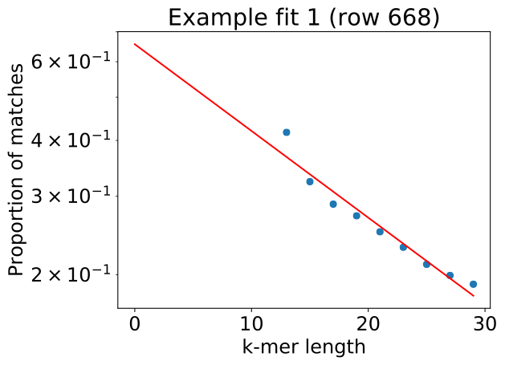
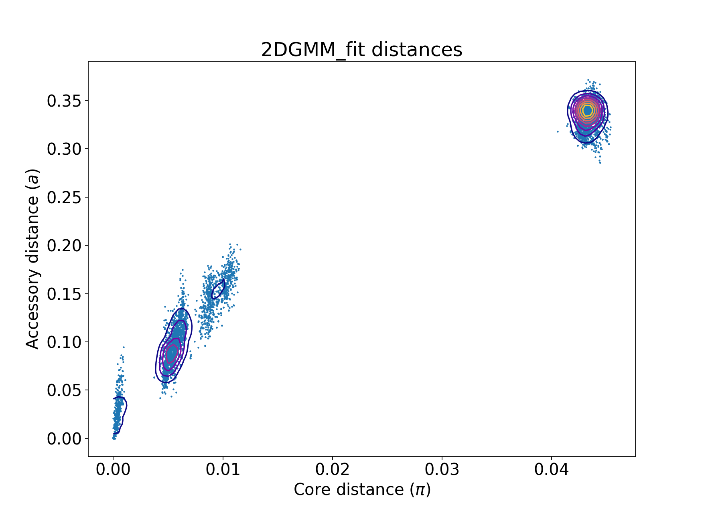
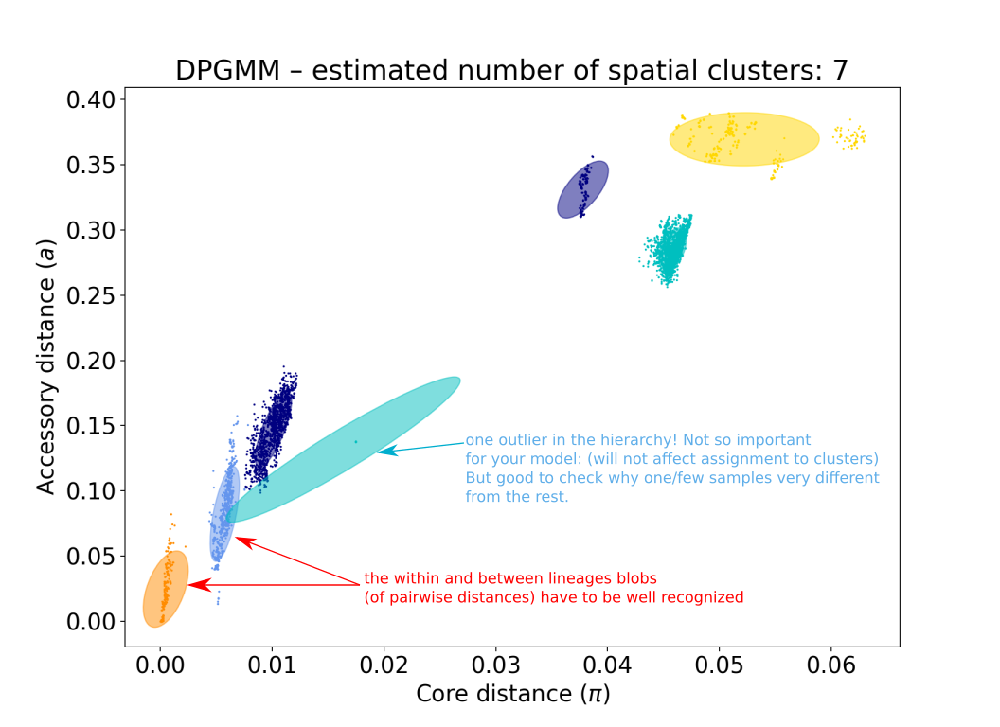
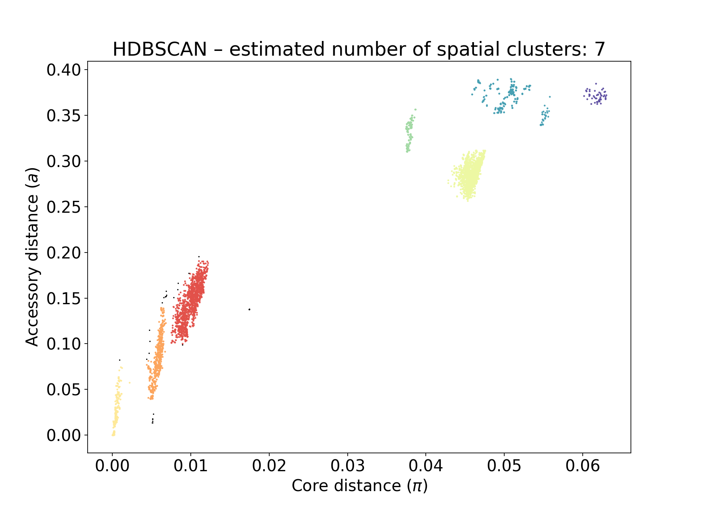
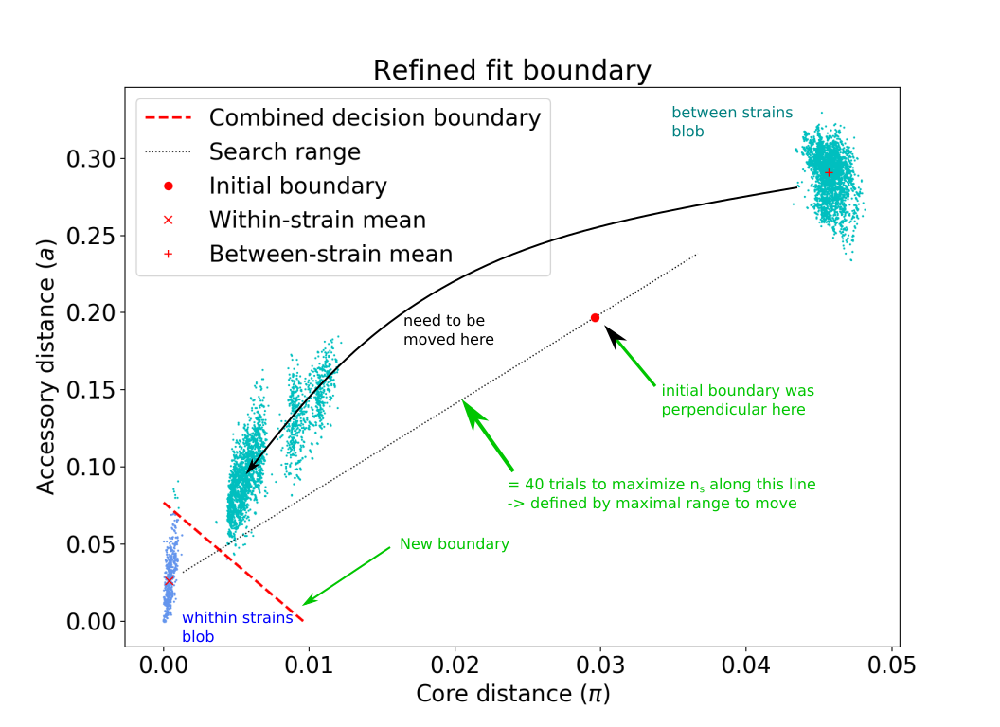
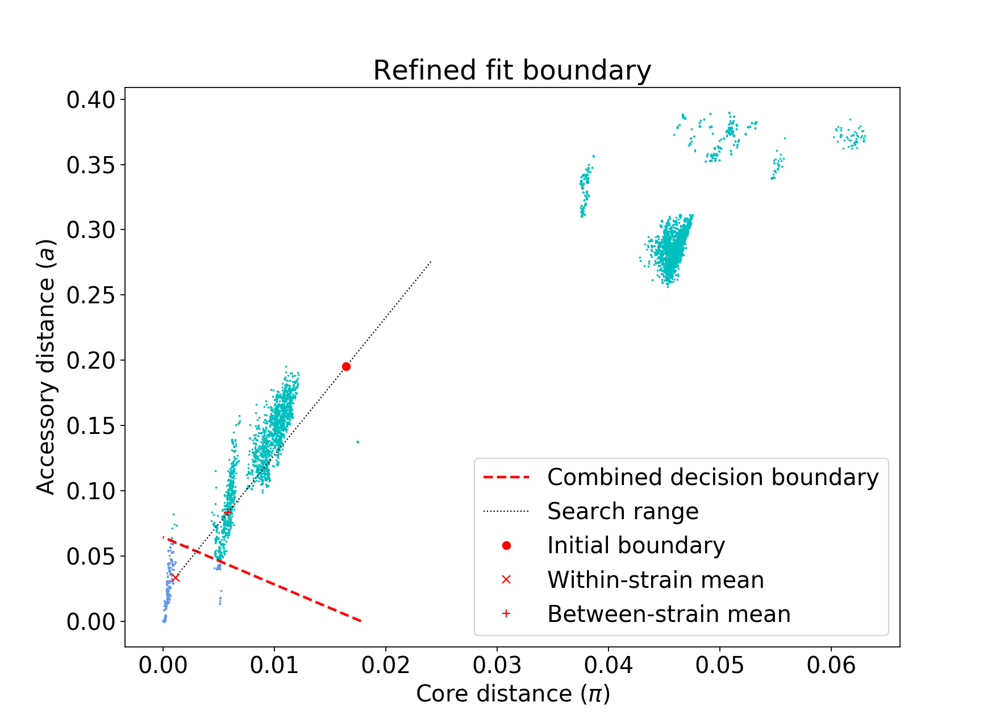

# [PopPUNK](https://genome.cshlp.org/content/29/2/304) : Population Partitioning Using Nucleotide K-mers

Presentation video: [ubioinfo virtual lab talk 2019-04-01 John Lees](https://youtu.be/uEoah6_XSSE)

[Introduction to Methods and interpretation: presentation](https://docs.google.com/presentation/d/1StmmM02lSpFPdevQT3iDB3BAKRoMC8Q4NtJ4nzu7MdY/edit?usp=sharing)

Here is an overview of what it does, and a basic starting guide. 
Some parts have been merly are a reorganisation and some nearly identical insertions [ex files produced] from the authors original tutorial, it just felt more logical to have everything at the same place). 
Please consult the [original tutuorial](https://poppunk.readthedocs.io/en/latest/tutorial.html)

## 1.1 Summary - Overview

- whole genome (core + accessory) population analysis/clustering. Coding and non-coding.
- distinction between isolates : uses [mash] with a range of k-mers at different lengths to estimate **pairwise core and accessory distances** between isolates
- the distribution of pairwise distances is used to discriminate between clusters of isolates: within or between strains (and discrimination of different hierarchical levels of distances).
- When the model used for clustering has been defined: new isolates can easily be added, without the need to re-analyze all samples. Clusters naming remain consistent, and metadata import allows using previously defined naming (ie. MLST)
- Database maintenance free, the size of the database can be kept small by using representative isolates for each cluster (automatically chosen) once the model has been fitted for your species of interest.
- predefined database with model fit can be found at: <https://figshare.com/articles/PopPUNK_databases/6683624>.
- This software has been developed for rapid outbreak detection. It is possible to analyze up to 10^4 samples with one run.

[mash]:https://genomebiology.biomedcentral.com/articles/10.1186/s13059-016-0997-x

# 2. How to use PopPUNK: first steps

[Manual](https://poppunk.readthedocs.io/). Note that the manual has been written for slightly different versions of PopPUNK. Therefore some command names in the documentation might be slightly different than the PopPUNK version installed on Abel (in conda). To check that the command corresponds to the version installed on Abel, use: `poppunk --help`

Activate PopPUNK: `source activate poppunk`

PopPUNK workflow is really simple, but can appear complicated because several options can be combined and several steps can be done at once.
Keep it simple: do one step at the time to understand what it does.

[Overview of commands](https://poppunk.readthedocs.io/en/latest/options.html)

Below is an overview of PopPUNK workflow: we will do each step separately: focus on each part (boxes with thick dark lines)


It looks complicated because there are many ways to combine the different options, but actually we can obtain a full analysis with 1 (or 2 commands if you adjust your model). Most of the extra elements is either for creating output for visualisation or for adjusting models to difficult datasets. what is in the light blue box is actually all you need.

## 2.1 Create database

1)  create a list of your assemblies and other sequences you want to include in the analysis:
`NB`: You need to have the path of the file included, so you need to create the list **from the folder you will run PopPUNK**:

Ex:
```
cd $USERWORK
mkdir data && cd data
ln -s <path to your data> . # softlinking your sequences in the data folder
cd ..

# here you create your reference file
ls <path/*.fasta>  > reference_files.txt  # in this example path = data
```

2) Use the `--create-db` option which creates: the _mash sketches database (*.msh)_ and the _distances database_ (and a file containing isolate names)

```bash
# Only creates database of pairwise distances
poppunk --create-db --r-files <reference_files.txt> --output <db_folder>  \
    --threads <2> --plot-fit <5>
```
`--min-k` the default k-mer size is set to 9. This might be low (increase with this option)

`--plot-fit <nb>`: creates a number of fits plot (relating k-mer to core/accessory distances) for the number of randomly chosen pairs of samples.
Will help you determine if the k-mer size range is appropriately chosen (see below)

--------------------------------------------------------------------------------

**What is happening:**

1) reference files are hashed at different k-mer lengths using [mash (documentation)](https://mash.readthedocs.io/en/latest/index.html).

2) Jaccard pairwise distances between sequences are calculated

Accessory and core distances are estimated jointly: through probability estimates of the number of k-mers matching over a range of 5 k-mer sizes. (5 k-mer sizes has been evaluated to provide a good estimate)

Decomposing accessory and core distance is possible because: small k-mer size allow accessory distance to be independent of k-mer size (but k-mers size must be large enough such as k-mers do not match randomly between sequences)

| Produced files          | extension |
| ----------------------- | --------- |
| Mash sketches databases | *.msh     |
| Pairwise distances      | *.npy     |
| Pairwise isolate ID     | *.pkl     |
| fit plots (distances - kmer size range)  |  *.pdf  |


--------------------------------------------------------------------------------
A) **Evaluate the console output:**

```
#example of console output
Creating mash database for k = 13
Random 13-mer probability: 0.04
Found existing mash database distances_db/distances_db.13.msh for k = 13
Creating mash database for k = 17
Random 17-mer probability: 0.00
...
```

- Random k-mer probability match must be inferior to 5% - if you want to be more stringent, you can increase the minimum k-mer length: `--min-k <17>`. Default step between k-mer sizes is set to 4. You can also change that using: `--k-step <4>` Read [here](https://poppunk.readthedocs.io/en/latest/troubleshooting.html#kmer-length) if necessary.

**BUT**: if k-mer size is to big you will get a warning: `outliers`

B) **Inspect the plots** to determine if the range of k-mer size used is adequate:
- the plots represent: regressions of log(pr(pa,b): the proportion of k-mers matching at length k between sequences a and b (for random sample pairs a and b). You want a straight line, and no outliers

<p align="center">

</p>

If the assembly length of your isolates is highly variable (due to real structural variation) you can add the option `--ignore-length` which will ignore outliers due to sequence length.

If your species has really low diversity you can increase sketch size. Here is default 10^4: `--sketch-size <10000>`. (Try maybe 10^5)

## 2.2 Model fitting to the distribution of core and accessory distance data

**Blobs**: will represent distances between hierarchies of distances types (ex: within strains, between strains ...)

### 2.2.1 Fitting the model: `--fit-model`, using 2D Gaussian mixed model (2DGMM)

```
poppunk --fit-model \
--distances <distances_folder/folder.dists> \
--ref-db <distance_folder> \
--output <output_folder> \
--full-db --K <nb_blobs:default2> \
```

| Produced files                                                                                   | extension                     |
| ------------------------------------------------------------------------------------------------ | ----------------------------- |
| **scatter plot of the distance distribution fitted by the model + kernel-density estimate**      | **_distanceDistrubution.png** |
| **scatter plot of all distances, and mixture model fit and assignment**                          | **_DPGMM_fit.png**            |
| contours of likelihood function fitted to data - Red: decision boundary (between/within strains) | _DPGMM_fit_contours.pdf       |
| saved parameters for the fitted model (weights, means, covariances, within, between, scale)      | _fit.npz                      |
| prior parameters used to fit the model (command)                                                 | _fit.pkl                      |
| network used to predict clusters (nodes and edges)                                               | _graph.gpickle                |
| **clusters determined for current model**                                                        | **_clusters.csv**             |

Figures:

| Kernel desity estimates | 2DGMM blobs identified |
| :-----------------------: | :----------------------: |
|  |  |
| NB: can be used to identify outliers and contamination | Each blob: a hierarchy in pairwise distances levels |

**For the strange blob:** A good explanation from [johnlees](https://github.com/johnlees/PopPUNK/issues/45):
> *"this component will have a very low weight compared to the others, and so won't have anything assigned to it unless it's right on top of that point. We just plot the means and covariances of the components it looks like the components with large covariances will have lots of things assigned to them (in this case the covariance is large because the single point doesn't contain enough information to shrink it down from the prior). We don't currently represent the weights of the components in the plot, e.g. by changing their opacity, but if we did that strange blob would pretty much disappear"*

### 2.2.2 Fitting the model: `--fit-model`, using DBSCAN `--dbscan`

DBSCAN is a [Density-Based Clustering Based on Hierarchical Density Estimates](https://link.springer.com/chapter/10.1007%2F978-3-642-37456-2_14).  DBSCAN is converted into a hierarchical clustering algorithm: [HDBSCAN](https://hdbscan.readthedocs.io/en/latest/how_hdbscan_works.html)

Basically it uses the density of points representing the pairwise distances to find the different blocs (clusters of distance).
> therefore a minimum of pairwise distance its expected for the algorithm to perform well

`--dbscan` will estimate the number of blobs (representing distances between different hierarchies) for you

```bash
poppunk --fit-model \
--distances distances_db/distances_db.dists \
--ref-db distances_db \
--output <DBSCAN_fit> --full-db --dbscan
```

You should obtain something like that:

<center>


### Evaluate the model:

- Model: Fit summary:
  - `Number of components used`: represents the number of blobs (--K) <=> the number of hierarchies
  - `Avg. entropy of assignment`: confidence of assignment to blobs (near 0 = well defined = confidence)

- Network summary:
  - `components used` <=> the number of populations/clusters-groups (not blobs)
  - `Transitivity`: **must be high** (near 1 -> everything within a cluster belongs to same strain/cluster-groups <=> fewer within- than between-strain links)
  - `network density`: **must be low** (means few isolate per group <=> good separation between population/cluster-groups: meaning fewer within than between strains links
  - `network score`: **summary for evaluating model** -> must be close to 1 (>0.8). Score is calculated using density and transitivity

[click here for more technical explanations](https://poppunk.readthedocs.io/en/latest/tutorial.html#creating-a-database)

If your model is not satisfactory, **your options are**:

  - if blobs not well delimited: you can try to **increase sketch sizes when creating distances data-basis**.
  > Modifying sketch size when creating distance database increases the sensibility of SNPs detection (increases running time), therefore allows a better discrimination between distances. _Theoretically down to single SNPs_

  > NB: you might need to add `--no-stream` option if using large sketch sizes

  - adjust your k-mer size range
  - **adjust boundaries** (how core and accessory distances are used to discriminate between clusters)
  > see next step: model refinement

### 2.3 Model refinement `--refine-model` (refining based on previously fitted model with either 2DGMM or DBSCAN)

**Important: refining might not be necessary**, it depends on your data set. If the model proposed in model fitting appears satisfactory there is no need to refine the model.

Explanation from [johnlees](https://github.com/johnlees/PopPUNK/issues/45):
> *When using refine model there are no longer mixture components/blobs defined [...].
> The refine model plot is now the output, representing the new model. There are only two categories of assignment (within or between strains).*

A overview of what you will have to check:

| Unappropriate fitting | Better fit |
|:----------------:|:---------------:|
|  | |

Tweak the existing fit and pick a better boundary to distinguish within and between strains.

NB: **Better not to chose the same output folder as the initial model-fit when refining the model.**
 > Choosing a different folder will allow you to gradually adjust your model: starting from the same initial model, and insuring you see which files are created at each step.
 > When you refine the model the fit is updated - and it gets complicated to optimize step-by-step when you are not optimizing from the same starting point. But when you are sure your fit is good, then you can re-run all the command in the same folder if you wish.

```
poppunk --refine-model --distances <distances_db/distances_db.dists> \
--model-dir <MODEL_fit> --ref-db distances_db --full-db --output <MODEL_refine> \
--full-db <model options> <shifting-options>
```
Boundary shifting options
- `--pos-shift <POS_SHIFT>` (away from origin)
- `--neg-shift <NEG_SHIFT>` (towards origin)
- `--indiv-refine` allow decision boundary to be placed independently for core/accessory distances
- `--manual-start <manual_start.txt>` allows to specify which blobs should be used as within and between strains (see bellow - use for  difficult datasets only)

Same files types are produced as previously (updated fit-view: **with initial and combined decision boundary**).

**Additional option:**
`--external-clustering` one can provide cluster names or labels that have been previously defined by any other method. This could include, for example, another clustering methods IDs, serotypes, clonal complexes and MLST assignments. The input is a CSV file which is formatted as follows:
```
sample,serotype,MLST
sample1,12,34
sample2,23F,1
```
> NB: PopPUNK does not like extra lines, if it does not work, check your formating.

> NB: sample has to be the list of file with the path included, as created for the `reference_files.txt` when creating the database

--------------------------------------------------------------------------------
**Re-evaluate your model (as previously)**
--------------------------------------------------------------------------------

**For difficult data sets:**

The models assume that core and accessory distances are correlated. This might not be true for:
- species/groups showing "low diversity"
- for species where core and accessory genomes have independent evolution histories. (ex. lots of recombination, blurs in blobs, lots insertions eg. prophages...)

It is possible to optimize models using core distance only (vertical boundary) or accessory only (horizontal boundary). See [supplement article](https://www.biorxiv.org/content/10.1101/360917v2.supplementary-material?versioned=true)

option:  `--manual-start <filename>`
 > we need to create a triangular boundary - move forward and backward FROM starting point (40 positions are tested within the range)
 ```
 mean0 x,y #for within strains blob
 mean1 x,y #for between strains blob
 start x,y #starting point to move boundary to
 ```
 > You can use the scaled components of means (the means for each pairwise distance blobs - to adjust your indiv-refine parameters) to begin your adjustments.

 ```bash
 #example of start.txt content
 mean0 0.02710312,0.08597808 # important: no space between core and accessory coordinates
 mean1 0.09182244,0.2144062
 start_point 0.4 #important: check that there is no empty line afterwards
 ```

## 2.4. Simplification database (optional)
When the model fit is good -> then we can stop using the `--full-db` option (but not compulsory).

Only isolates representative of each cluster will be kept (only slight decrease in assignment  quality to new clusters) if your database.

## 2.5. Using the model to generate trees, and cluster outputs, or using the model on a different set of isolates

NB: you can** create a distance database** and then **use a predefined model** (fitted on another dataset) on this database to cluster your isolates.

```
poppunk --use-model --model-dir <fitted-model_directory> \
--distances <distances_folder/folder.dists> \
--ref-db <distance_folder> \
--output <output_folder> \
-<visualisation-options>\
```

Here is an example:
```bash
poppunk --use-model --model-dir <2DGMM_fit> \
--distances <new_dist_db/new_dist_db.dists> \
--ref-db <distances_db> \
--output <use_2DGMM_model> \
--microreact -perplexity <30> --cytoscape # visualisation options
```

## 2.6 Adding new sequences = assigning queries

When your have chosen which model you will use, you can use assign queries to use
the model you created with new isolates.

> addition of new pairwise distances to the reference network
1. pairwise distances are calculated
2. added as nodes in network to clusters
3. clusters name **DO NOT CHANGE** - unless merged: then both labels displayed on merged cluster, if no old cluster matches based on the model, new-clusters are created

NB: if you do not want to update the database: do not use `--update-db`

Create the list of sequences to add to your query:

```bash
ls <folder_file/*pattern> > query_list.txt

# main options: for security if you had changed sketch size use also the option here
poppunk --assign-query \
--ref-db <database> \
--distances  <distances_folder/folder.dists> \
--q-files <query_list.txt> \
--output <strain_query> \
--threads <3> --update-db

# you can add all options required to create graphs also: example
poppunk --assign-query --sketch-size 100000 \
--ref-db distances_db \
--distances distances_db/distances_db.dists \
--model-dir 2DGMM_fit \
--q-files query_list.txt \
--output our_samples_query \
--update-db \
--microreact --rapidnj rapidnj --perplexity 30 --cytoscape
```

`--update-db` will update your database if previous clusters are merged or new cluster are created

Optional
`--model-dir <directory>`  if fitted model is in a separated directory
`--previous-clustering <directory>` directory of previous clustering/network (if in different directory, by default uses the directory containing the model)
`--core-only` or `--accessory-only` if you only used one distance type for fitting the model

> **IMPORTANT**: for adding further queries: you need to use the new database: stored in strain-query `--ref-db <strain_query>`

## 2.7. output for visualisation: options of the clustering (tree and network)
For using the same parameters that lead to a good model with `--use-model`.
Those parameters can be used also when `refining, refitting or assigning queries`.

- `--microreact`	Generates output files for [Microreact] visualisation
- `--info-csv <metadata.csv>` additional metadata: ex: date collection, geographical coordinates, Epidemiological information, comma delimited and formatted for microreact (can be used with other outputs)
- `--cytoscape	`Generates network output files for [Cytoscape]
- `--phandango`	Generates phylogeny and TSV for [Phandango] visualisation
- `--grapetree`	Generates phylogeny and CSV for [Grapetree] visualisation
- `--perplexity `PERPLEXITY (Perplexity used to calculate t-SNE projection (with `--microreact` NB: default=20.0)
- `--rapidnj` If you want to build [rapidNJ] tree for [Microreact]), use `--rapidnj rapidnj` as RAPIDNJ is installed in the same conda environment as PopPUNK

```bash
# Example
poppunk --use-model --model-dir 2DGMM_fit \
--distances distances_db/distances_db.dists \
--ref-db new_distances_db \
--output use_2DGMM_model \
--microreact --rapidnj rapidnj --perplexity 30 --cytoscape
```

Extra links:
- [Cytoscape github](https://github.com/cytoscape)
- [Cytoscape tutorials](https://github.com/cytoscape/cytoscape-tutorials/wiki)
- [Phandango Git](https://github.com/jameshadfield/phandango)
- [Grapetree documentation](https://enterobase.readthedocs.io/en/latest/grapetree/grapetree-about.html)
- [RAPIDNJ documentation](http://birc.au.dk/Software/RapidNJ/)

[Microreact]:https://microreact.org/showcase
[Cytoscape]:https://cytoscape.org/
[Cytoscape Youtube]:https://www.youtube.com/watch?v=KIJ6M1nvKoY
[Phandango]:https://academic.oup.com/bioinformatics/article/34/2/292/4212949
[Grapetree]:https://genome.cshlp.org/content/28/9/1395.full
[rapidNJ]:http://users-birc.au.dk/cstorm/software/rapidnj/papers/SimonsenOthers2008_WABI.pdf

**Please look at [at our R_trees course](./R_trees.md) for looking at trees with R**
and at [Poppunk visualisation](./poppunk_visualisation.md) for visualising networks with Cytoscape.

# Going further, faster ...

## Creating the database
There are 2 solutions to create the database:
1) the quick start option: `--easy-run` allows creating the database and fitting model in one step using `dbscan`
2) the `--create-db` option (as above)

When you understood how PopPUNK is functioning, you do not need to change folder each time.
You can run all the commands in the same folder.

## NB: Conda version :
Per 2019-04-25 the conda version of poppunk has some bugs, the fix of those bugs have been incorporated on github. If for some reason you want to install poppunk on your pc with conda system, you can do as such:

```
#install the non updated version of poppunk conda (then you get all the dependencies)
conda create --name <poppunk_or_env_name> -c bioconda poppunk

#then you need to activate conda
conda activate <poppunk_or_env_name>

#remove the original poppunk installed in conda
conda remove poppunk

#install pip
conda install -c anaconda pip

#need to install the git version of poppunk with pip in conda
pip install git+https://github.com/johnlees/PopPUNK.git

#start poppunk as usual, this should work
```

## Some more examples?
It is a work in progress, but you can find some other examples of simple scripts for:
- running PopPUNK - used to create some of this tutorial
- wrangling/cleaning metadata and creating a tree with R (with `ggtree`)
- looking and files produced by PopPUNK (in python3)
- simple cleaning of output file (labels) for Cytoscape (in python3)
in [Eve's github](https://github.com/evezeyl/R_poppunk.git)

# Summary - Files produced (in case you wonder)

| File extension | what                                                                | when            |
| :-------------:|:-----------------------------------:|:---------------------:|
| *.search.out   | pairwise core & accessory distances                                 | ?  git version? |
| *graph.gpickle | network used to predict clusters                                    | model fitting   |
| *DPGMM_fit.png | scatter plot of all distances, and mixture model fit and assignment | model fitting   |
| *DPGMM_fit_contours.png  | contours of likelihood function fitted to data |  model fitting |
| *distanceDistribution.png    | scatter plot of the distance distribution fitted by the model + kernel-density estimate |  model fitting     |
| *.csv                       | isolate names and the cluster assigned                                                                                   |  model fitting        |
| *(db).png                   | unclustered distribution of distances used in the fit (subsampled from total)                                            |  model fitting |
| *.npz                        | save fit parameters                        |  model fitting     |
| *refs                       | representative references in the new database                             | (unless --full-db was used) |
| *dbscan.png                 | scatter plot of all distances, and DBSCAN assignment.                      | --dbscan                    |
| *external_clusters.csv     | CSV file relating the samples to previous clusters provided in the input CSV.                         | --external-clustering       |
| *core_dists.csv            | matrix of pairwise core distances                                                                                      | --microreact                |
| *acc_dists.csv             | matrix of pairwise accessory distances                                                                                  | --microreact                |
| *core_NJ_microreact.nwk    | neighbour joining tree using core distances (for microreact)                                                            | --microreact                |
| *perplexity5.0_accessory_tsne.dot | t-SNE embedding of accessory distances at given perplexity                    | --microreact                |
| *microreact_clusters.csv         | cluster assignments plus any epi data added with the --info-csv option (for microreact)                     | --microreact                |
| *cytoscape.csv                   | cluster assignments plus any epi data added with the --info-csv option (for cytoscape)                      | --cytoscape                 |
| *cytoscape.graphml          | XML representation of resulting network (for cytoscape)                                                                 | --cytoscape                 |
| *refined_fit.png             | plot of the new linear boundary, and core and accessory distances coloured by assignment to either side of this boundary | --fit-model           |
| *refined_fit.npz                | **The saved parameters of the refined fit.**                                                                             | --fit-model            |
| *clusters.csv + .gpickle       |  for core and accessory                                                                      |--fit-model  --indiv-refine |
