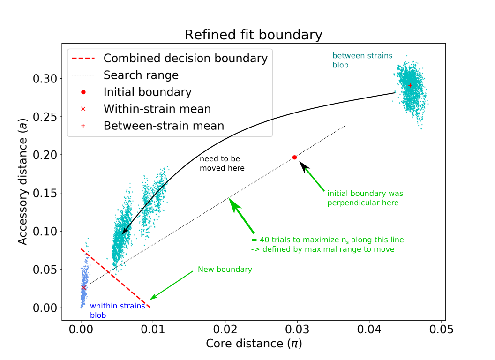

# 1. What is [PopPUNK](https://genome.cshlp.org/content/29/2/304) : Population Partitioning Using Nucleotide K-mers

Presentation video: [ubioinfo virtual lab talk 2019-04-01 John Lees](https://youtu.be/uEoah6_XSSE)

[Methods and interpretation presentation](https://docs.google.com/presentation/d/1StmmM02lSpFPdevQT3iDB3BAKRoMC8Q4NtJ4nzu7MdY/edit?usp=sharing)

- less good for low diversity species, and when blur (lots of recombination)
-
## 1.1 Summary - Overview

[Manual](https://poppunk.readthedocs.io/)
[PopPUNK Documentation](https://poppunk.readthedocs.io/en/latest/index.html)
[Presentation](https://docs.google.com/presentation/d/1StmmM02lSpFPdevQT3iDB3BAKRoMC8Q4NtJ4nzu7MdY/edit?usp=sharing)

- whole genome (core + accessory) population analysis/clustering
- distinction between isolates : uses k-mer of different length: `mash` to find core and accessory distances between isolates (**pairwise**)
- the distribution of those distances is used to discriminate clusters (defined as strains) of closely related isolates (similarity:both core and accessory)
- clustering of newly added isolates: EXTENDABLE4 - without the need of reanalizing all samples
- maintenance free and auto-reduce database
> aimed for consistent naming clusters between studies, outbreak detection in minutes
- analyse up to 10^4 samples in single step - possible to add new samples
-
# 2. How to use PopPUNK: first steps


## 2.1 Create datadase

- create a list of your assemblies and other sequences you want to include in the analysis:
`NB`: You need to have the path of the file included, so you need to create the list from the folder you will run PopPUNK:

`ls <path/*.fasta>  > reference_files.txt`

- There are 2 solutions to create the database:

```bash
# only database
poppunk --create-db --r-files <reference_files.txt> --output <db_folder>  \
    --threads <2> --plot-fit <5>

# OR
# database and first model fitting in one step (see bellow)
poppunk --easy-run --r-files <reference_files.txt> --output <db_folder> --threads <4> --plot-fit <5> --min-k <13> --full-db
```
--------------------------------------------------------------------------------
What happens:
1) reference files are hashed at different k-mer lenghts (using [mash](https://mash.readthedocs.io/en/latest/index.html).
2) pairwise distances between sequences are calculated
> Accessory and core distances are estimated jointly: through probabilities estimates of the number of k-mers matching over a range of k-mer sizes. Decomposing accessory and core distance is allowed because:
- Small k-mer size allow accessory distance to be independent of k-mer size (but k-mers size must be large enough such as k-mers do not match randomly between sequences)
-  EXPLain better

core distances are estimated through the range of k-mer size (estimate density SNPs over )

#picture
--------------------------------------------------------------------------------
`inspect the plots created and the console output`, to determine if the range of k-mer size used is adequate:
- #kmer must be inferior  <- stats here
- #the plots represent: regressions of log(pr(pa,b): the proportion of k-mers matching at length k between sequences a and b (for random sample pairs a and b):

Read [here](https://poppunk.readthedocs.io/en/latest/troubleshooting.html#kmer-length) if there is adjusting need of the k-mer size-range. Ex: add options `--min-k <15> --kmer-step <2>`

## 2.2 Fitting a model



Blobs: will represent distances between hierarchies of distances (ex: within strains, between strains, between populations, clones...)

You need to choose between 2D Gaussian mixed model () OR DBSCAN models to fit the distribution of core and accessory distance data:
- `--K <nb blobs>` (default blobs = 2):
> equal likelihood contours and decision boundary (within and between cluster-assignments )
- `--dbscan` will estimate the number of blobs (representing distances between different hierarchies) for you

`poppunk --fit-model --distances <distances_folder/folder.dists> --ref-db <distance_folder> \
--output <output_folder> --full-db` + a model option ex: `--K <nb_blubs>`

`--model` will also copy over the model fit, so that the entire PopPUNK database is in a single directory
`--external-clustering` one can provide cluster names or labels that have been previously defined by any other method. This could include, for example, another clustering methods IDs, serotypes, clonal complexes and MLST assignments. The input is a CSV file which is formatted as follows:

sample,serotype,MLST
sample1,12,34
sample2,23F,1

> trick for seing plot : test! - [ ] use move with bondary with 0

> kernel density estimate - > can be used to identify outliers and contamination (program to remove those isolates from DB) > - [ ] where?


- how to do: accessory, core, and combined clusters (see sup material) - [ ]

### Evaluate the model:

- Model: Fit summary:
  -- `Number of components used`: represents the number of blobs (--K) <=> the number of hierarchies
  -- `Avg. entropy of assignment`: confidence of assignment to blobs (near 0 = well defined = confidence)

- Network summary:
 -- components used <=> the number of populations/clusters (not blobs)
 -- Transitivity: must be high (near 1 -> everything within a cluster belongs to same strain/cluster-groups <=> fewer within- than between-strain links)
 -- network density **must be low** (means few isolate per group <=> good separation between population/cluster-groups: meaning fewer within than between strains links
 -- `network score` = **summary for evaluating model** -> must be close to 1 (>0.8). Score is calculated using density and transitivity

In the network: edges are pairwise distances, nodes are isolates

[More technical explanations:](https://poppunk.readthedocs.io/en/latest/tutorial.html#creating-a-database)

If your model is not satisfactory
- blobs not well delimited: you can try to increase sketch sizes when creating distances data-basis
- adjust your k-mer size range
- adjust boundaries (how core and accessory distances are used to discriminate between clusters)

> **important to look at the network**
#Not that+  - `silhouette index`?? = measure of how similar an object is to its own cluster (cohesion) compared to other clusters (separation)


#### 2.3 Model refinement (improvement model) `--refine-model`

 Tweak the existing fit and pick a better boundary to distinguish within and between strains.

`poppunk --refine-model --distances <distances_db/distances_db.dists> --model-dir <MODEL_fit> --ref-db distances_db --full-db --output <MODEL_refine> --full-db <model options> <shifting-options>`

Model options:
- For 2D GMM `--K <nb_blubs>`
- For HDBSCAN `--dbscan`

- Boundary shifting options
`--pos-shift <POS_SHIFT>` (away from origin)
`--neg-shift <NEG_SHIFT>` (towards origin)

> Re-evaluate your model

--------------------------------------------------------------------------------
For difficult data sets:

The models assume that core and accessory distances are correlated. This might not be true for:
- species/groups showing "low diversity" -> a and %pi not necessary correlated - analyze independently (see [supplement article](https://www.biorxiv.org/content/10.1101/360917v2.supplementary-material?versioned=true))
- it is also possible to optimize models using core distance only (vertical boundary) or accessory only (horizontal boundary). Useful when/if core and accessory genomes have independent evolution histories. (ex. lots of recombination, blurs in blobs, lots insertions eg. prophages...)

 `--indiv-refine` allow these boundaries to be placed independently on core/accessory

 `--manual-start <filename>`
 > need to create a triangular⁵ boundary - move forward and backward FROM starting point (range)
 ```
 mean0 (x,y) #for within strains blob
 mean1 (x,y) #for between strains blob
 start (x,y) #starting point to move boundary to
 ```

**Modifing sketch size when creating distance database** (increase sensibility detection SNPs also increases running time) -> but allow a better discrimination between distances. Theoretically down to single SNPs

## 2.4. Simplification database (optional)
When model is good -> then we can stop using `--full-db` option (but not compulsory). See manual.

## 2.5 Visualization resuts
Output can be made either from `--model-fit` or `--refine-model`, using the same parameters that lead to a good model with `-- use-model`

`--microreact`	Generate output files for [Microreact] visualisation

`--rapidnj` RAPIDNJ (Path to rapidNJ software if you want to build rapidNJ tree for [Microreact])
`--info-csv` INFO_CSV (additional metadata: Epidemiological information CSV formatted for microreact (can be used with other outputs))

`--cytoscape	`Generate network output files for [Cytoscape]
`--phandango`	Generate phylogeny and TSV for [Phandango] visualisation
`--grapetree`	Generate phylogeny and CSV for [Grapetree] visualisation

`--perplexity `PERPLEXITY (Perplexity used to calculate t-SNE projection (with –microreact) [default=20.0])


## 2.6 Adding new sequences = assigning queries
> addition to the reference network
1. pairwise distances are calculated
2. added as nodes in network to clusters
3. clusters name **DO NOT CHANGE** - unless merged -> then both labels displayed on merged cluster

`poppunk --assign-query --ref-db <database> --q-files <query_list.txt> --output <strain_query> --threads <3> --update-db`

> optional `--model-dir <directory>`  if fitted model is in a separated directory
> previsous clustering/network: `--previous-clustering`

> **OOPS!** for further adding queries: need to use the new database: stored in strain-query `--ref-db <strain_query>`

### Queries using core or accessory only;

--ref-db <refine-model-db> `--core-only`
--ref-db <refine-model-db> `--accessory-only `

________________________________________________________________________________
[Microreact]:https://microreact.org/showcase
[Cytoscape]:
[Phandango]:
[Grapetree]

XXXXXXXXXXXXXXXXXXXXXXXXXXXXXXXXXXXXXXXXXXXXXXXXXXXXXXXXXXXXXXXXXXXXXX

# Summary - Files produced

| File extension                   | what                                                                                                                     | when                        |
| -------------------------------- | ------------------------------------------------------------------------------------------------------------------------ | --------------------------- |
| *.search.out                     | pairwise core & accessory distances                                                                                      |                             |
| *graph.gpickle                   | network used to predict clusters                                                                                         |                             |
| *DPGMM_fit.png                   | scatter plot of all distances, and mixture model fit and assignment                                                      |                             |
| *DPGMM_fit_contours.png          | contours of likelihood function fitted to data                                                                           |                             |
| *distanceDistribution.png        | scatter plot of the distance distribution fitted by the model + kernel-density estimate                                  |                             |
| *.csv                            | isolate names and the cluster assigned                                                                                   |                             |
| *(db).png                        | unclustered distribution of distances used in the fit (subsampled from total)                                            |                             |
| *.npz                            | save fit parameters                                                                                                      |                             |
| *refs                            | representative references in the new database                                                                            | (unless --full-db was used) |
| *dbscan.png                      | scatter plot of all distances, and DBSCAN assignment.                                                                    | --dbscan                    |
| *external_clusters.csv           | CSV file relating the samples to previous clusters provided in the input CSV.                                            | --external-clustering       |
| *core_dists.csv                  | matrix of pairwise core distances                                                                                        | --microreact                |
| *acc_dists.csv                   | matrix of pairwise accessory distances                                                                                   | --microreact                |
| *core_NJ_microreact.nwk          | neighbour joining tree using core distances (for microreact)                                                             | --microreact                |
| *perplexity5.0_accessory_tsne.dot | t-SNE embedding of accessory distances at given perplexity                                                               | --microreact                |
| *microreact_clusters.csv         | cluster assignments plus any epi data added with the --info-csv option (for microreact)                                  | --microreact                |
| *cytoscape.csv                   | cluster assignments plus any epi data added with the --info-csv option (for cytoscape)                                   | --cytoscape                 |
| *cytoscape.graphml               | XML representation of resulting network (for cytoscape)                                                                  | --cytoscape                 |
| *refined_fit.png                 | plot of the new linear boundary, and core and accessory distances coloured by assignment to either side of this boundary | --fit-model                 |
| *refined_fit.npz                | **The saved parameters of the refined fit.**                                                                             | --fit-model                 |
| *clusters.csv + .gpickle       |  for core and accessory                                                                      |--fit-model  --indiv-refine |
