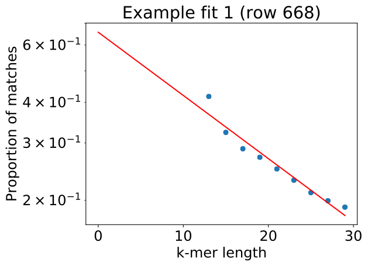

# 1. What is [PopPUNK](https://genome.cshlp.org/content/29/2/304) : Population Partitioning Using Nucleotide K-mers

Presentation video: [ubioinfo virtual lab talk 2019-04-01 John Lees](https://youtu.be/uEoah6_XSSE)

[Introduction to Methods and interpretation: presentation](https://docs.google.com/presentation/d/1StmmM02lSpFPdevQT3iDB3BAKRoMC8Q4NtJ4nzu7MdY/edit?usp=sharing)

## 1.1 Summary - Overview

- whole genome (core + accessory) population analysis/clustering. Coding and non-coding.
- distinction between isolates : uses `mash` with a range of k-mers at different lengths to estimate **pairwise core and accessory distances** between isolates
- the distribution of pairwise distances is used to discriminate between clusters of isolates: within or between strains (and discrimination of different hierarchical level of distances).
- When the model used for clustering has been defined: new isolates can easily be added, without the need to re-analyze all samples. Clusters naming remain consistent, and metadata import allows using previously defined naming (ie. MLST)
- Database maintenance free, the size of the database can be kept small by using representative isolates for each cluster (automatically chosen) once the model has been fitted for your species of interest.
- predefined database with model fit can be found at:<https://figshare.com/articles/PopPUNK_databases/6683624>
- This software has been developed for rapid outbreak detection. It is possible to analyze up to 10^4 samples in a single steps.  

# 2. How to use PopPUNK: first steps

[Manual](https://poppunk.readthedocs.io/). Note that the manual has been written for slightly different versions of PopPUNK. Therefore some command names in the documentation might be slightly different than the PopPUNK version installed on Abel.

Activate PopPUNK: `source activate poppunk`

To check command synthax: `poppunk --help`

PopPUNK workflow is really simple, but can appear complicated because several options can be combined and several steps can be done at once. Keep it simple: do one step at the time to understand what it does.

Commands that can be combined: [Overview](https://poppunk.readthedocs.io/en/latest/options.html)


## 2.1 Create datadase

- create a list of your assemblies and other sequences you want to include in the analysis:
`NB`: You need to have the path of the file included, so you need to create the list from the folder you will run PopPUNK:

`ls <path/*.fasta>  > reference_files.txt`

- There are 2 solutions to create the database:
1) the quick start option: `--easy-run` does 2 steps at once (not recommended for learning) which does both create the database and does the first model fitting
2) Use the `--create-db` option which only creates: the _mash sketches database_ and the _distances database_ (also create a file containing isolate names)

```bash
# only database
poppunk --create-db --r-files <reference_files.txt> --output <db_folder>  \
    --threads <2> --plot-fit <5>
```
--------------------------------------------------------------------------------
What is happening:
1) reference files are hashed at different k-mer lenghts using [mash](https://mash.readthedocs.io/en/latest/index.html).
2) pairwise distances between sequences are calculated

Accessory and core distances are estimated jointly: through probabilities estimates of the number of k-mers matching over a range of 5 k-mer sizes. (5 k-mer sizes has been evaluated to provide a good estimate)
Decomposing accessory and core distance is possible because: small k-mer size allow accessory distance to be independent of k-mer size (but k-mers size must be large enough such as k-mers do not match randomly between sequences)

#picture
--------------------------------------------------------------------------------
**Evaluate:** inspect the plots created and the console output, to determine if the range of k-mer size used is adequate:
```
Creating mash database for k = 13
Random 13-mer probability: 0.04
Found existing mash database distances_db/distances_db.13.msh for k = 13
Creating mash database for k = 17
Random 17-mer probability: 0.00
...
```
- Random k-mer probability match must be inferior to 5% - if you want to be more stringent, you can increase the minimum k-mer length: `--min-k <17>`. Default step between k-mer sizes is set to 4. You can also change that using: `--k-step <4>` Read [here](https://poppunk.readthedocs.io/en/latest/troubleshooting.html#kmer-length) if necessary. NB: if k-mer size is to big you will get a warning: `outliers`

- the plots represent: regressions of log(pr(pa,b): the proportion of k-mers matching at length k between sequences a and b (for random sample pairs a and b). You want a straight line, and no outliers

<p align="center">

</p>

If the assembly length of your isolates is highly variable (due to structural variation) you can add the option `--ignore-length` which will ignore outliers due to sequence length.

If your species has really low diversity you can increase sketch size. Here is default: `--sketch-size <10000>`

## 2.2 Fitting a model


Blobs: will represent distances between hierarchies of distances (ex: within strains, between strains, between populations, clones...)

You need to choose between 2D Gaussian mixed model () OR DBSCAN models to fit the distribution of core and accessory distance data:
- `--K <nb blobs>` (default blobs = 2):
> equal likelihood contours and decision boundary (within and between cluster-assignments )
- `--dbscan` will estimate the number of blobs (representing distances between different hierarchies) for you

`poppunk --fit-model --distances <distances_folder/folder.dists> --ref-db <distance_folder> \
--output <output_folder> --full-db` + a model option ex: `--K <nb_blubs>`

`--model` will also copy over the model fit, so that the entire PopPUNK database is in a single directory
`--external-clustering` one can provide cluster names or labels that have been previously defined by any other method. This could include, for example, another clustering methods IDs, serotypes, clonal complexes and MLST assignments. The input is a CSV file which is formatted as follows:

sample,serotype,MLST
sample1,12,34
sample2,23F,1

> trick for seing plot : test! - [ ] use move with bondary with 0

> kernel density estimate - > can be used to identify outliers and contamination (program to remove those isolates from DB) > - [ ] where?


- how to do: accessory, core, and combined clusters (see sup material) - [ ]

### Evaluate the model:

- Model: Fit summary:
  -- `Number of components used`: represents the number of blobs (--K) <=> the number of hierarchies
  -- `Avg. entropy of assignment`: confidence of assignment to blobs (near 0 = well defined = confidence)

- Network summary:
 -- components used <=> the number of populations/clusters (not blobs)
 -- Transitivity: must be high (near 1 -> everything within a cluster belongs to same strain/cluster-groups <=> fewer within- than between-strain links)
 -- network density **must be low** (means few isolate per group <=> good separation between population/cluster-groups: meaning fewer within than between strains links
 -- `network score` = **summary for evaluating model** -> must be close to 1 (>0.8). Score is calculated using density and transitivity

In the network: edges are pairwise distances, nodes are isolates

[More technical explanations:](https://poppunk.readthedocs.io/en/latest/tutorial.html#creating-a-database)

If your model is not satisfactory
- blobs not well delimited: you can try to increase sketch sizes when creating distances data-basis
- adjust your k-mer size range
- adjust boundaries (how core and accessory distances are used to discriminate between clusters)

> **important to look at the network**
#Not that+  - `silhouette index`?? = measure of how similar an object is to its own cluster (cohesion) compared to other clusters (separation)


#### 2.3 Model refinement (improvement model) `--refine-model`

 Tweak the existing fit and pick a better boundary to distinguish within and between strains.

`poppunk --refine-model --distances <distances_db/distances_db.dists> --model-dir <MODEL_fit> --ref-db distances_db --full-db --output <MODEL_refine> --full-db <model options> <shifting-options>`

Model options:
- For 2D GMM `--K <nb_blubs>`
- For HDBSCAN `--dbscan`

- Boundary shifting options
`--pos-shift <POS_SHIFT>` (away from origin)
`--neg-shift <NEG_SHIFT>` (towards origin)

> Re-evaluate your model

--------------------------------------------------------------------------------
For difficult data sets:

The models assume that core and accessory distances are correlated. This might not be true for:
- species/groups showing "low diversity" -> a and %pi not necessary correlated - analyze independently (see [supplement article](https://www.biorxiv.org/content/10.1101/360917v2.supplementary-material?versioned=true))
- it is also possible to optimize models using core distance only (vertical boundary) or accessory only (horizontal boundary). Useful when/if core and accessory genomes have independent evolution histories. (ex. lots of recombination, blurs in blobs, lots insertions eg. prophages...)

 `--indiv-refine` allow these boundaries to be placed independently on core/accessory

 `--manual-start <filename>`
 > need to create a triangular⁵ boundary - move forward and backward FROM starting point (range)
 ```
 mean0 (x,y) #for within strains blob
 mean1 (x,y) #for between strains blob
 start (x,y) #starting point to move boundary to
 ```

**Modifing sketch size when creating distance database** (increase sensibility detection SNPs also increases running time) -> but allow a better discrimination between distances. Theoretically down to single SNPs

## 2.4. Simplification database (optional)
When model is good -> then we can stop using `--full-db` option (but not compulsory). See manual.

## 2.5 Visualization resuts
Output can be made either from `--model-fit` or `--refine-model`, using the same parameters that lead to a good model with `-- use-model`

`--microreact`	Generate output files for [Microreact] visualisation

`--rapidnj` RAPIDNJ (Path to rapidNJ software if you want to build rapidNJ tree for [Microreact])
`--info-csv` INFO_CSV (additional metadata: Epidemiological information CSV formatted for microreact (can be used with other outputs))

`--cytoscape	`Generate network output files for [Cytoscape]
`--phandango`	Generate phylogeny and TSV for [Phandango] visualisation
`--grapetree`	Generate phylogeny and CSV for [Grapetree] visualisation

`--perplexity `PERPLEXITY (Perplexity used to calculate t-SNE projection (with –microreact) [default=20.0])


## 2.6 Adding new sequences = assigning queries
> addition to the reference network
1. pairwise distances are calculated
2. added as nodes in network to clusters
3. clusters name **DO NOT CHANGE** - unless merged -> then both labels displayed on merged cluster

`poppunk --assign-query --ref-db <database> --q-files <query_list.txt> --output <strain_query> --threads <3> --update-db`

> optional `--model-dir <directory>`  if fitted model is in a separated directory
> previsous clustering/network: `--previous-clustering`

> **OOPS!** for further adding queries: need to use the new database: stored in strain-query `--ref-db <strain_query>`

### Queries using core or accessory only;

--ref-db <refine-model-db> `--core-only`
--ref-db <refine-model-db> `--accessory-only `

________________________________________________________________________________
[Microreact]:https://microreact.org/showcase
[Cytoscape]:
[Phandango]:
[Grapetree]

XXXXXXXXXXXXXXXXXXXXXXXXXXXXXXXXXXXXXXXXXXXXXXXXXXXXXXXXXXXXXXXXXXXXXX

# Summary - Files produced

| File extension                   | what                                                                                                                     | when                        |
| -------------------------------- | ------------------------------------------------------------------------------------------------------------------------ | --------------------------- |
| *.search.out                     | pairwise core & accessory distances                                                                                      |                             |
| *graph.gpickle                   | network used to predict clusters                                                                                         |                             |
| *DPGMM_fit.png                   | scatter plot of all distances, and mixture model fit and assignment                                                      |                             |
| *DPGMM_fit_contours.png          | contours of likelihood function fitted to data                                                                           |                             |
| *distanceDistribution.png        | scatter plot of the distance distribution fitted by the model + kernel-density estimate                                  |                             |
| *.csv                            | isolate names and the cluster assigned                                                                                   |                             |
| *(db).png                        | unclustered distribution of distances used in the fit (subsampled from total)                                            |                             |
| *.npz                            | save fit parameters                                                                                                      |                             |
| *refs                            | representative references in the new database                                                                            | (unless --full-db was used) |
| *dbscan.png                      | scatter plot of all distances, and DBSCAN assignment.                                                                    | --dbscan                    |
| *external_clusters.csv           | CSV file relating the samples to previous clusters provided in the input CSV.                                            | --external-clustering       |
| *core_dists.csv                  | matrix of pairwise core distances                                                                                        | --microreact                |
| *acc_dists.csv                   | matrix of pairwise accessory distances                                                                                   | --microreact                |
| *core_NJ_microreact.nwk          | neighbour joining tree using core distances (for microreact)                                                             | --microreact                |
| *perplexity5.0_accessory_tsne.dot | t-SNE embedding of accessory distances at given perplexity                                                               | --microreact                |
| *microreact_clusters.csv         | cluster assignments plus any epi data added with the --info-csv option (for microreact)                                  | --microreact                |
| *cytoscape.csv                   | cluster assignments plus any epi data added with the --info-csv option (for cytoscape)                                   | --cytoscape                 |
| *cytoscape.graphml               | XML representation of resulting network (for cytoscape)                                                                  | --cytoscape                 |
| *refined_fit.png                 | plot of the new linear boundary, and core and accessory distances coloured by assignment to either side of this boundary | --fit-model                 |
| *refined_fit.npz                | **The saved parameters of the refined fit.**                                                                             | --fit-model                 |
| *clusters.csv + .gpickle       |  for core and accessory                                                                      |--fit-model  --indiv-refine |
