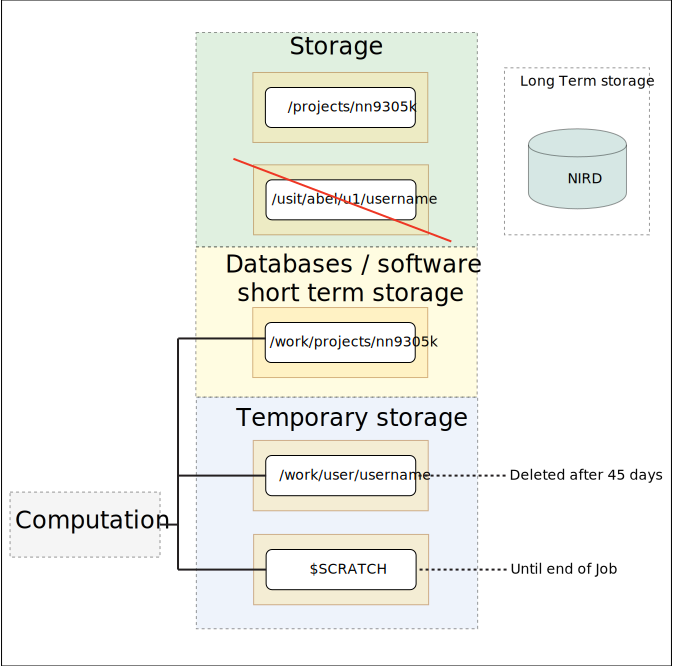

# Working with remote computers

## A note on notation

The `$` sign denotes commands in the shell. Do not type in the dollar
sign.

Some places you need to type in something that will or may vary with
each of you. If so, the thing that you should change is between
arrow brackets, like \<this\>.


## Logging in and out

We will use the program called `ssh` to log in and out of abel.

--------

**Task**
1. open a terminal window
2. type in the following (don't include the `$`).

```
$ ssh <your_user_name>@abel.uio.no
```

It will then request a password. Type it in. Remember, passwords are
case sensitive!

--------


NOTE: If you have the same username on your virtual machine and on
abel, you don't need to type in your username and the at sign in
the ssh command.

### Figuring out which computer you're on

Sometimes you might get confused about which computer you're
currently on. You can use the command `hostname` to figure out where you
are.

--------
**Task**

1. type in `hostname` in a terminal window on your computer
2. type in `hostname` in a terminal window

--------

### File structure on abel

There are three main storage locations that you need to know about on
abel (Fig. 1).

 * Your home (**$HOME**) area `usit/abel/u1/username`. When you log in, you will automatically land in what is called your **home area**. You will commonly not use this location much, and it should not be used to store sequence data that is from the Veterinary Institute (Fig. 1).

 * The **work area**, `/work/projects/nn9305k` (Fig. 1). This is where the Veterinary Institute stores the databases we use and the software we install ourselves. You can store intermediate files here when you are analyzing data, but this area should not be used for storing RAW sequence data. Think of it as one of the common ressource areas on the Veterinary Institute area.

 * The last one is the **project**'s data and analysis backup area. This is
 `/projects/nn9305k`(Fig. 1). This is the area where all RAW sequence data  that belongs to the Veterinary Institute should be stored.


**Figure 1** Abel data storage overview for the Veterinary Institute. Variables that can be used in slurm scripts or commands are indicated between brackets.

There is also a forth area that will be discussed below and that is mainly used for data storage when analyzing data. It should not be used for storage, and after analysis data should be transfered to the **project** or the **work area**. For a detailed overview and how to use these areas please look at the description of [disks_areas](./disk_areas.md) at the Norwegian VeterinaryInstitute, to see the data workflow when launching/running jobs.

--------

**Task**
1. use `cd` to go to the work-project area.
2. read the `README` file that is in the top directory of the home area
3. use the knowledge gained from the README file to figure out where
adapter files are stored on abel.

---------

### Setting up your working directory

Next we will do a bit of setup to get you set up properly on abel.

--------

**Task**
Go to [this webpage here](https://github.com/NorwegianVeterinaryInstitute/organizational/wiki/Abel-User-Guide)
and follow the instructions from and bellow: "On first time login".

NB: login out of abel: `exit` or `logout`

---------

Note: if you've done this already, you can skip this step.

During the setup process, you are creating a separate "home directory"
inside the **project area**. You use this location for things that you
don't collaborate with people on. If it is a collaborative project,
that is, other people on abel will also use it, you use directories
at the top level.


## Transferring files

We will now explore a couple of methods for getting data to and from
abel.

NOTE: any transfer of data to abel happens with permission from Karin!

--------

**Task**
1. [right click on this link and download the file.](mb.fsa)
2. go to the directory you downloaded the file to on your computer
and locate the file
3. open the file - how many fasta sequences are in the file?

---------

### scp

We will now transfer this file to abel.

--------

**Task**
1. on the virtual machine, type in
```
$ scp mb.fsa your_user_name@abel.uio.no:
```
2. open a different terminal window and log in to abel
3. find out where the file is now (hint: `ls`)

--------

You need to have the colon on the end, otherwise you just end up
copying the file to a file named `your_user_name@abel.uio.no`.

Note: if you have the same username on your virtual machine as on abel,
you don't need to type in your user name or the at sign.

You have now transferred a file from your computer to abel. That file
ended up in your home area. What do you have to do to get it into your
home area on the project area? If you want to put it in a different
location than the default place you end up when you log in, you need
to specify the path to that location after the colon. That is:

```
$ scp filename your_user_name@abel.uio.no:/path/to/different/place
```

--------

**Task**
Try putting the `mb.fsa` file into your project home area using scp.

--------

We have now transferred to abel. How do we get files to our local
computer? To do that, we switch things up in the command:

```
$ scp your_user_name@abel.uio.no:/path/to/file/on/abel local_place_path
```
You need to do this on your local machine.

More often than not, you want to store things in the location you're
at, which means that `local_place_path` would be a simple dot, i.e. `.`.


### rsync

rsync is a command that lets you transfer things within and between
computers, while ensuring that the data is not corrupted on the way.

This command has many options, as do other commands under unix. One set
of options that is commonly used with `rsync` is `-rauPW`.

--------

**Task**
Have a look at the wikipedia page for rsync. Can you figure out the
syntax for rsync?

--------

### checking that file transfer completed without incident:

You can either:
>  - redo rsyn with same options: if the transfer was successfull, nothing will
be synchronized (same content).
>  - use **hash** programs that generates a code based on file content
(for both original and transfered/copied file). If both codes are identical,
this means that the content of each files are identical i.e. that the file
transfer was successull.

> use for ex. `md5sum file_origin`and `md5sum file_transfered`. The hash-codes
should be identical.

> Better to [automate] the process of checkingif you have many files
> - create a temporary file `tempfile_md5sum.txt`
> - generate md5sum for each files (use expressions) and append result to
`tempfile_md5sum.txt`
> - `md5sum yourfiles | tee "tempfile_md5sum.txt"`
> - `md5sum -c "tempfile_md5sum.txt"`
> - check the content of your file: it will idicate if there are differences
(if so, start again transfer for files where checksum does not match).
> - delete your temporary file `tempfile_md5sum.txt`

### wget

wget is very useful for getting data from a website to either your local
computer or to a remote computer.

We will now try to get the `mb.fsa` file onto abel without going via
our own local machine.

--------

**Task**
1. right click on the url for the file (see above), and copy the link.
2. go in your abel terminal window
3. make sure that you are in your projects-home area
3. type and paste in

```
$ wget <paste_the_link_here>
```

and hit enter.

You will now have downloaded the file directly onto abel.

--------

## Bioinformatics software on abel

There is a lot of software available on abel. We cannot have all of it
available at the same time, because they would step on each others'
toes. To organize software, the abel system uses the `module` system.

--------

**Task**
1. on abel, type in `module avail`
2. wait for a bit
3. can you figure out how many versions of blast is installed?
4. try typing in `module avail blast`, and see what happens.

--------

As you see, one of these have the word (default) typed into it. This
means that if you do

```
$ module load <software_name_before_slash>
```

that is the version of the program that will be loaded.

**If you want a different version than the _default version_, you need to
include what's after the `/`.

NB: You can also look at short description of [Software on Abel] here

[Software on Abel]:https://www.uio.no/english/services/it/research/hpc/abel/help/software/

### Running commands, and using modules

We will now try our hands at running a quick blast command.

NOTE: running things like this, on the login nodes, is not really
"done". However, small test commands can be run. If you run things that
either use too much time (30 minutes) or too much memory, the command
will be terminated.

When we are `blast`ing, we need sequences that we're searching with
(`query`), and we need a database to search in. On abel, there are
versions of the ncbi databases that live here:


```
/work/databases/bio/ncbi
```

--------

**Task**
1. on abel, type in
```
$ module load blast+
```
2. type in
```
$ blastn -help
```
Can you figure out which options that you need to specify a query and
a database?
3. On abel, type in
```
$ blastn -query mb.fsa -db /work/databases/bio/ncbi/refseqgene
```
You will get output fairly quickly. You might want to save that output,
do that by repeating the command and add `-out <a_new_filename>`.

--------

## qlogin

The previous command gave results quite quickly.

We will now try to search against a different database, a database that
is bigger, and where searches thus take longer time to run. For this,
we will use a `qlogin` shell. With `qlogin`, you get a "normal"
prompt, but you are using slurm allocated resources, thus you can
use more resources than you can on the login nodes.

The options we will specify to `qlogin` are:

  - **account**: which bucket of cpu hours to use. Ours is nn9305k
  - **time**: for how long do we want this command line window to run
  - **ntasks**:  number of cpus to use.
  - **mem-per-cpu**: how much memory we want

The more you ask for, the longer you have to wait for things to start.


--------

**Task**
1. Start `qlogin` with the following options
```
qlogin --account=nn9305k --time=00:30:00 --ntasks=4 --mem-per-cpu=4G
```
You might have to wait a bit to get the prompt back.
2. Run `ls`. You will see that you are now in your home area. Use
`cd` and `ls` to go to the location where the `mb.fsa` file is. You
also have to re-load the blast module.
3. Try running the same blast command as above. However, do the
following change:

  - use multiple CPUs, by adding `-num_threads 4`

--------

Note: we are here using 4 CPUs, which is the same number of CPUs
that we asked for when we started `qlogin`. **It is important that these
two numbers are the same.**

### Commands

We will now do the same using a **script file** instead. To work with the
queueing system in this way, we need to know a few commands:

  * **sbatch** - submit a slurm script to the queue
  * **squeue** - look at the current queue
  * **scancel** - cancel a job which is in the queue

--------

**Task**

We will now create a **slurm script**, and put our blast command into it.

1. make sure you are in your _project-home_ area
2. copy the file `sample_slurm.slurm` file in _samplefiles_ directory to this
location
3. open the file using `nano`
4. edit the file so that you are using the same options that
you used with the `qlogin` command above.
5. add the command to load the blast module at the bottom
6. add the blast command line you used above under the module load
command.
7. submit the script to the queue, by typing in

```
$ sbatch sample_slurm.slurm
```

--------

**Task**

We will now look at jobs submitted to the cluster.

1. try out the command `squeue`
2. try looking at just jobs under our project, by adding `-A nn9305k`
3. try looking at just your jobs, by adding `-u <your_user_name>`

--------

The status of jobs shows up under `ST`.

 * **PD**: the job is waiting for resources
 * **R**: running
 * **CF**: the system has allocated resources, but the job is waiting for
 them to become ready

There are also other statuses.

Another important feature that you can find here is the **job id**. If
you need to cancel a job, you need this number.


--------

**Task**

We will now look at the output file that slurm gives us.

1. use `ls` to find a file in this directory that ends with `*.out`
2. look at it.

--------

If you need to cancel a job, this is the command you would give:

```
scancel <jobid>
```

--------

**Task**

You will now edit the slurm script so that you instead of searching
in the refseq_genome database, you will search the **nt** database. This
will take a long time!

After editing the file, submit it to the queue system using `sbatch`.
Then, use `squeue` and `scancel` to stop the job.


--------

**Optional task**

If there's time, restart the slurm job above, and let it finish. Have
a look at the output both from slurm and bash

---------

[automate]:https://askubuntu.com/questions/442960/how-to-automate-comparison-of-md5sum-hash-values-for-a-large-number-of-files
